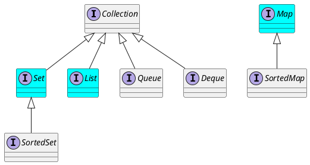

<!-- slide -->

# Introduction

<!-- slide -->

## Java Collection 「集合框架」

* Reduces programming effort 減少編程工作量
* Increases performance 提升性能
* Provides interoperability between unrelated APIs 提供不相干應用程序接口之間的互操作性
* Reduces the effort required to learn APIs 減少學習應用程序接口的開銷
* Reduces the effort required to design and implement APIs 減少設計和實現應用程序接口的開銷
* Fosters software reuse 促進軟件重用

<!-- slide -->

## List, Set and Map

