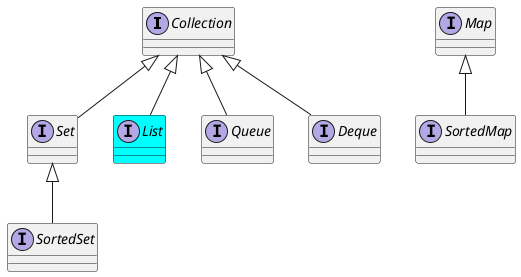

# List Interface

<!-- slide -->

## Inheritance Hierarchy



<!-- slide -->

## Operations

* Positional access
* Search
* Iteration
* Range-view

<!-- slide -->

## Positional access

* get
* set
* add
* remove

<!-- slide -->

## Get and Set

```java
list.set(index, putValue);
E getValue = list.get(index);
assertEquals(putValue, getValue);// they MUST equal
```

<!-- slide -->

## Add and remove

```java
list.add(index,putValue);
E removedValue = list.remove(index);
assertEquals(putValue, removedValue);// they MUST equal
```

<!-- slide -->

## Search

* indexOf
* lastIndexOf

<!-- slide -->

## Iterators

```java
public interface ListIterator<E> extends Iterator<E> {
  boolean hasNext();
  E next();
  boolean hasPrevious();
  E previous();
  int nextIndex();
  int previousIndex();
  void remove();
  void set(E var1);
  void add(E var1);
}
```

<!-- slide -->

## Range-view Operation

* `subList(int fromIndex, int toIndex)`

```puml
digraph d {
    subListLabel [shape=none,label="subList(1,4)"]
    listLabel [shape=none,lable="list"]
    subList [shape=record,label="<o>o|<r>r|<l>l"]
    list [shape=record,label="<w>W|<o>o|<r>r|<l>l|<d>d|!"]

    subList:o -> list:o
    subList:r -> list:r
    subList:l -> list:l

    subListLabel -> subList
    listLabel -> list
    {rank=same;subListLabel,subList}
    {rank=same;listLabel,list}
}
```

<!-- slide -->

## Range-view backed by list

```puml
digraph d {
    subListLabel [shape=none,label="subList(1,4)"]
    listLabel [shape=none,lable="list"]
    subList [shape=record,label="<o>o|<x>x|<l>l"]
    list [shape=record,label="<w>W|<o>o|<x>x|<l>l|<d>d|!"]

    subList:o -> list:o
    subList:x -> list:x
    subList:l -> list:l

    subListLabel -> subList
    listLabel -> list
    {rank=same;subListLabel,subList}
    {rank=same;listLabel,list}
}
```

<!-- slide -->

## Implementaions

* General-Purpose
    * ArrayList
    * LinkedList
* Special-Purpose
    * CopyOnWriteArrayList
    * Vector

<!-- slide -->

## Reading

* [The List Interface](https://docs.oracle.com/javase/tutorial/collections/interfaces/list.html)

<!-- slide -->

## Thank you
