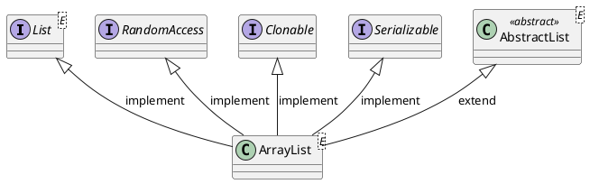

<style>
.reveal h1, .reveal h2, .reveal h3, .reveal h4, .reveal h5, .reveal h6 {
    text-transform: none;
}
.reveal .slide svg {
    background-color: white;
}
.reveal .large-table tr {
    line-height: 1;
}
</style>

<!-- slide -->

# ArrayList

<!-- slide -->

## Inheritance Hierarchy



<!-- slide -->

## Data Structure

```puml
digraph d {

    index [shape=record,label="<0>0|<1>1|<2>2|<3>3|<4>4|<5>5|<6>6|<7>7|<8>8|<9>9",style=dotted]
    storage [shape=record,label="<0>W|<1>O|<2>R|<3>L|<4>D|<5> |<6> |<7> |<8> |<9> "]

    index:0 -> storage:0
    index:1 -> storage:1
    index:2 -> storage:2
    index:3 -> storage:3
    index:4 -> storage:4
    index:5 -> storage:5
    index:6 -> storage:6
    index:7 -> storage:7
    index:8 -> storage:8
    index:9 -> storage:9

    size [shape=none,label="size = 5"]
    capacity [shape=none,label="capacity = 10"]
    {rank=same;size,capacity}
}
```

<!-- slide -->

## Operations

* `boolean add(E e)`
* `void add(int index, E element)`
* `E get(int index)`
* `E remove(int index)`
* `E set(int index, E element)`
* `int indexOf(Object o)`

<!-- slide -->

## Time Complexity

Operation|Time Complexity
---------|---------------
add(E element)|$\mathcal{O}(1)$
add(int index, E element)|$\mathcal{O}(n)$
get(int index)|$\mathcal{O}(1)$
remove(int index)|$\mathcal{O}(n)$
set(int index, E element)|$\mathcal{O}(1)$
indexOf(Object o)|$\mathcal{O}(n)$

<!-- slide -->

## add(E e)

```puml
digraph d {

    index [shape=record,label="<0>0|<1>1|<2>2|<3>3|<4>4|<5>5|<6>6|<7>7|<8>8|<9>9",style=dotted]
    storage [shape=record,label="<0>W|<1>O|<2>R|<3>L|<4>D|<5> |<6> |<7> |<8> |<9> "]

    index:0 -> storage:0
    index:1 -> storage:1
    index:2 -> storage:2
    index:3 -> storage:3
    index:4 -> storage:4
    index:5 -> storage:5
    index:6 -> storage:6
    index:7 -> storage:7
    index:8 -> storage:8
    index:9 -> storage:9

    size [shape=none,label="size = 5"]
    capacity [shape=none,label="capacity = 10"]
    {rank=same;size,capacity}
}
```

```java
list.add('X');
```

<!-- slide -->

## add(E e)

```puml
digraph d {

    index [shape=record,label="<0>0|<1>1|<2>2|<3>3|<4>4|<5>5|<6>6|<7>7|<8>8|<9>9",style=dotted]
    storage [shape=record,label="<0>W|<1>O|<2>R|<3>L|<4>D|<5>X|<6> |<7> |<8> |<9> "]

    index:0 -> storage:0
    index:1 -> storage:1
    index:2 -> storage:2
    index:3 -> storage:3
    index:4 -> storage:4
    index:5 -> storage:5
    index:6 -> storage:6
    index:7 -> storage:7
    index:8 -> storage:8
    index:9 -> storage:9

    size [shape=none,label="size = 6",style=filled,fillcolor=orange]
    capacity [shape=none,label="capacity = 10"]
    {rank=same;size,capacity}
}
```

<!-- slide -->

## add(E e) Code

```java
public boolean add(E e) {
    ensureCapacityInternal(size + 1);  // Increments modCount!!
    elementData[size++] = e;
    return true;
}
```

<!-- slide -->

## add(E e) Time Complexity

$$
\begin{align*}
complexity &= 1+1 \\
  &= 2 \\
  &= \mathcal{O}(1)
\end{align*}
$$

<!-- slide class="large-table" -->

## add(E e) Benchmark

Operation|(n)|AverageTime|Unit
---------|---|-----------|----
add|10000|0.008|s/op
add|20000|0.007|s/op
add|30000|0.007|s/op
add|40000|0.007|s/op
add|50000|0.007|s/op
add|60000|0.007|s/op
add|70000|0.007|s/op
add|80000|0.007|s/op
add|90000|0.007|s/op
add|100000|0.007|s/op

<!-- slide -->

## add(E e) Benchmark

```python {cmd=true hide=true args=["-W ignore"] matplotlib=true}
import numpy as np
from scipy.optimize import curve_fit
import matplotlib.pyplot as plt
x = np.array([10000,20000,30000,40000,50000,60000,70000,80000,90000,100000],dtype=float)
y = np.array([0.008,0.007,0.007,0.007,0.007,0.007,0.007,0.007,0.007,0.007],dtype=float)

plt.plot(x,y,'ro')
plt.ylim(np.amin(y)/10)
plt.xlabel('(n)')
plt.ylabel('AverageTime')

def bigOn(x, a, b):
    return a * x + b

def bigO1(x,a):
    return 0 * x + a

def fitAndDrawCurve(func, variables, outcomes, notation,figure):
    popt, pcov = curve_fit(func, variables, outcomes)
    handler, = figure.plot(variables, func(variables, *popt), notation, label="Fitted Curve")
    return handler

bigO1Handler = fitAndDrawCurve(bigO1,x,y,'r-',plt)
plt.legend([bigO1Handler],['y = 0 * x + a'])
plt.show() # show figre
```

<!-- slide -->

## add(int index, E element)

```puml
digraph d {

    index [shape=record,label="<0>0|<1>1|<2>2|<3>3|<4>4|<5>5|<6>6|<7>7|<8>8|<9>9",style=dotted]
    storage [shape=record,label="<0>W|<1>O|<2>R|<3>L|<4>D|<5> |<6> |<7> |<8> |<9> "]

    index:0 -> storage:0
    index:1 -> storage:1
    index:2 -> storage:2
    index:3 -> storage:3
    index:4 -> storage:4
    index:5 -> storage:5
    index:6 -> storage:6
    index:7 -> storage:7
    index:8 -> storage:8
    index:9 -> storage:9

    size [shape=none,label="size = 5"]
    capacity [shape=none,label="capacity = 10"]
    {rank=same;size,capacity}
}
```

```java
list.add(3,'X');
```

<!-- slide -->

## add(int index, E element)

```puml
digraph d {

    index [shape=record,label="<0>0|<1>1|<2>2|<3>3|<4>4|<5>5|<6>6|<7>7|<8>8|<9>9",style=dotted]
    storage [shape=record,label="<0>W|<1>O|<2>R|<3> |<4>L|<5>D|<6> |<7> |<8> |<9> "]

    index:0 -> storage:0
    index:1 -> storage:1
    index:2 -> storage:2
    index:3 -> storage:3
    index:4 -> storage:4
    index:5 -> storage:5
    index:6 -> storage:6
    index:7 -> storage:7
    index:8 -> storage:8
    index:9 -> storage:9

    size [shape=none,label="size = 5"]
    capacity [shape=none,label="capacity = 10"]
    {rank=same;size,capacity}
}
```

<!-- slide -->

## add(int index, E element)

```puml
digraph d {

    index [shape=record,label="<0>0|<1>1|<2>2|<3>3|<4>4|<5>5|<6>6|<7>7|<8>8|<9>9",style=dotted]
    storage [shape=record,label="<0>W|<1>O|<2>R|<3>X|<4>L|<5>D|<6> |<7> |<8> |<9> "]

    index:0 -> storage:0
    index:1 -> storage:1
    index:2 -> storage:2
    index:3 -> storage:3
    index:4 -> storage:4
    index:5 -> storage:5
    index:6 -> storage:6
    index:7 -> storage:7
    index:8 -> storage:8
    index:9 -> storage:9

    size [shape=none,label="size = 6",style=filled,fillcolor=orange]
    capacity [shape=none,label="capacity = 10"]
    {rank=same;size,capacity}
}
```

<!-- slide -->

## add(int index, E element) Code

```java
public void add(int index, E element) {
    rangeCheckForAdd(index);

    ensureCapacityInternal(size + 1);  // Increments modCount!!
    System.arraycopy(elementData, index, elementData, index + 1,
                     size - index);
    elementData[index] = element;
    size++;
}
```

<!-- slide -->

## add(int index, E element) Time Complexity

$$
\begin{align*}
complexity &= n-i \\
&= \frac{1}{n}\sum\limits_{i=0}^{n-1} (n-i) \\
&= n-\frac{n}{2}+\frac{1}{2} \\
&= \mathcal{O}(n)
\end{align*}
$$

<!-- slide class="large-table" -->

## add(int index, E element) Benchmark

Operation|(n)|AverageTime|Unit
---------|---|-----|----
add(index,element)|10000|0.008|s/op
add(index,element)|20000|0.013|s/op
add(index,element)|30000|0.017|s/op
add(index,element)|40000|0.021|s/op
add(index,element)|50000|0.026|s/op
add(index,element)|60000|0.031|s/op
add(index,element)|70000|0.036|s/op
add(index,element)|80000|0.042|s/op
add(index,element)|90000|0.048|s/op
add(index,element)|100000|0.054|s/op

<!-- slide -->

## add(int index, E element) Benchmark

```python {cmd=true hide=true args=["-W ignore"] matplotlib=true}
import numpy as np
from scipy.optimize import curve_fit
import matplotlib.pyplot as plt
x = np.array([10000,20000,30000,40000,50000,60000,70000,80000,90000,100000],dtype=float)
y = np.array([0.008,0.013,0.017,0.021,0.026,0.031,0.036,0.042,0.048,0.054],dtype=float)

plt.plot(x,y,'ro')
plt.ylim(np.amin(y)/10)
plt.xlabel('(n)')
plt.ylabel('AverageTime')

def bigOn(x, a, b):
    return a * x + b

def bigO1(x,a):
    return 0 * x + a

def fitAndDrawCurve(func, variables, outcomes, notation,figure):
    popt, pcov = curve_fit(func, variables, outcomes)
    handler, = figure.plot(variables, func(variables, *popt), notation, label="Fitted Curve")
    return handler

bigOnHandler = fitAndDrawCurve(bigOn,x,y,'r-',plt)

plt.legend([bigOnHandler],['y = a * x + b'])
plt.show() # show figre
```

<!-- slide -->

## get(int index)

```puml
digraph d {

    index [shape=record,label="<0>0|<1>1|<2>2|<3>3|<4>4|<5>5|<6>6|<7>7|<8>8|<9>9",style=dotted]
    storage [shape=record,label="<0>W|<1>O|<2>R|<3>L|<4>D|<5> |<6> |<7> |<8> |<9> "]

    index:0 -> storage:0
    index:1 -> storage:1
    index:2 -> storage:2
    index:3 -> storage:3
    index:4 -> storage:4
    index:5 -> storage:5
    index:6 -> storage:6
    index:7 -> storage:7
    index:8 -> storage:8
    index:9 -> storage:9

    size [shape=none,label="size = 5"]
    capacity [shape=none,label="capacity = 10"]
    {rank=same;size,capacity}
}
```

```java
list.get(3);
```

<!-- slide -->

## get(int index) Code

```java
public E get(int index) {
    rangeCheck(index);

    return elementData(index);
}
```

```java
E elementData(int index) {
    return (E) elementData[index];
}
```

<!-- slide -->

## get(int index) Time Complexity

$$
\begin{align*}
complexity &= \mathcal{O}(1)
\end{align*}
$$

<!-- slide class="large-table" -->

## get(int index) Benchmark

Operation|(n)|AverageTime|Unit
---------|---|-----------|-----
get|10000|0.013|s/op
get|20000|0.015|s/op
get|30000|0.014|s/op
get|40000|0.014|s/op
get|50000|0.014|s/op
get|60000|0.015|s/op
get|70000|0.015|s/op
get|80000|0.016|s/op
get|90000|0.016|s/op
get|100000|0.016|s/op

<!-- slide -->

## get(int index) Benchmark

```python {cmd=true hide=true args=["-W ignore"] matplotlib=true}
import numpy as np
from scipy.optimize import curve_fit
import matplotlib.pyplot as plt
x = np.array([10000,20000,30000,40000,50000,60000,70000,80000,90000,100000],dtype=float)
y = np.array([0.013,0.015,0.014,0.014,0.014,0.015,0.015,0.016,0.016,0.016],dtype=float)

plt.plot(x,y,'ro')
plt.ylim(np.amin(y)/10)
plt.xlabel('(n)')
plt.ylabel('AverageTime')

def bigOn(x, a, b):
    return a * x + b

def bigO1(x,a):
    return 0 * x + a

def fitAndDrawCurve(func, variables, outcomes, notation,figure):
    popt, pcov = curve_fit(func, variables, outcomes)
    handler, = figure.plot(variables, func(variables, *popt), notation, label="Fitted Curve")
    return handler

bigO1Handler = fitAndDrawCurve(bigO1,x,y,'r-',plt)

plt.legend([bigO1Handler],['y = 0 * x + a'])
plt.show() # show figre
```

<!-- slide -->

## remove(int index)

```puml
digraph d {

    index [shape=record,label="<0>0|<1>1|<2>2|<3>3|<4>4|<5>5|<6>6|<7>7|<8>8|<9>9",style=dotted]
    storage [shape=record,label="<0>W|<1>O|<2>R|<3>L|<4>D|<5> |<6> |<7> |<8> |<9> "]

    index:0 -> storage:0
    index:1 -> storage:1
    index:2 -> storage:2
    index:3 -> storage:3
    index:4 -> storage:4
    index:5 -> storage:5
    index:6 -> storage:6
    index:7 -> storage:7
    index:8 -> storage:8
    index:9 -> storage:9

    size [shape=none,label="size = 5"]
    capacity [shape=none,label="capacity = 10"]
    {rank=same;size,capacity}
}
```

```java
list.remove(3);
```

<!-- slide -->

## remove(int index)

```puml
digraph d {

    index [shape=record,label="<0>0|<1>1|<2>2|<3>3|<4>4|<5>5|<6>6|<7>7|<8>8|<9>9",style=dotted]
    storage [shape=record,label="<0>W|<1>O|<2>R|<3> |<4>D|<5> |<6> |<7> |<8> |<9> "]

    index:0 -> storage:0
    index:1 -> storage:1
    index:2 -> storage:2
    index:3 -> storage:3
    index:4 -> storage:4
    index:5 -> storage:5
    index:6 -> storage:6
    index:7 -> storage:7
    index:8 -> storage:8
    index:9 -> storage:9

    size [shape=none,label="size = 5"]
    capacity [shape=none,label="capacity = 10"]
    {rank=same;size,capacity}
}
```

<!-- slide -->

## remove(int index)

```puml
digraph d {

    index [shape=record,label="<0>0|<1>1|<2>2|<3>3|<4>4|<5>5|<6>6|<7>7|<8>8|<9>9",style=dotted]
    storage [shape=record,label="<0>W|<1>O|<2>R|<3>D|<4> |<5> |<6> |<7> |<8> |<9> "]

    index:0 -> storage:0
    index:1 -> storage:1
    index:2 -> storage:2
    index:3 -> storage:3
    index:4 -> storage:4
    index:5 -> storage:5
    index:6 -> storage:6
    index:7 -> storage:7
    index:8 -> storage:8
    index:9 -> storage:9

    size [shape=none,label="size = 4",style=filled,fillcolor=orange]
    capacity [shape=none,label="capacity = 10"]
    {rank=same;size,capacity}
}
```

<!-- slide -->

## remove(int index) Code

```java
public E remove(int index) {
    rangeCheck(index);

    modCount++;
    E oldValue = elementData(index);

    int numMoved = size - index - 1;
    if (numMoved > 0)
        System.arraycopy(elementData, index+1, elementData, index,
                         numMoved);
    elementData[--size] = null; // clear to let GC do its work

    return oldValue;
}
```

<!-- slide -->

## remove(int index) Time Complexity

$$
\begin{align*}
complexity &= n-i \\
&= \frac{1}{n}\sum\limits_{i=0}^{n-1} (n-i) \\
        &= n-\frac{n}{2}+\frac{1}{2} \\
        &= \mathcal{O}(n)
\end{align*}
$$

<!-- slide class="large-table" -->

## remove(int index) Benchmark

Operation|(n)|AverageTime|Unit
---------|---|-----------|-----
remove|10000|0.002|s/op
remove|20000|0.006|s/op
remove|30000|0.011|s/op
remove|40000|0.015|s/op
remove|50000|0.020|s/op
remove|60000|0.025|s/op
remove|70000|0.030|s/op
remove|80000|0.035|s/op
remove|90000|0.041|s/op
remove|100000|0.047|s/op

<!-- slide -->

## remove(int index) Benchmark

```python {cmd=true hide=true args=["-W ignore"] matplotlib=true}
import numpy as np
from scipy.optimize import curve_fit
import matplotlib.pyplot as plt
x = np.array([10000,20000,30000,40000,50000,60000,70000,80000,90000,100000],dtype=float)
y = np.array([0.002,0.006,0.011,0.015,0.020,0.025,0.030,0.035,0.041,0.047],dtype=float)

plt.plot(x,y,'ro')
plt.ylim(np.amin(y)/10)
plt.xlabel('(n)')
plt.ylabel('AverageTime')

def bigOn(x, a, b):
    return a * x + b

def bigO1(x,a):
    return 0 * x + a

def fitAndDrawCurve(func, variables, outcomes, notation,figure):
    popt, pcov = curve_fit(func, variables, outcomes)
    handler, = figure.plot(variables, func(variables, *popt), notation, label="Fitted Curve")
    return handler

bigOnHandler = fitAndDrawCurve(bigOn,x,y,'r-',plt)

plt.legend([bigOnHandler],['y = a * x + b'])
plt.show() # show figre

```

<!-- slide -->

## set(int index, E element)

```puml
digraph d {

    index [shape=record,label="<0>0|<1>1|<2>2|<3>3|<4>4|<5>5|<6>6|<7>7|<8>8|<9>9",style=dotted]
    storage [shape=record,label="<0>W|<1>O|<2>R|<3>L|<4>D|<5> |<6> |<7> |<8> |<9> "]

    index:0 -> storage:0
    index:1 -> storage:1
    index:2 -> storage:2
    index:3 -> storage:3
    index:4 -> storage:4
    index:5 -> storage:5
    index:6 -> storage:6
    index:7 -> storage:7
    index:8 -> storage:8
    index:9 -> storage:9

    size [shape=none,label="size = 5"]
    capacity [shape=none,label="capacity = 10"]
    {rank=same;size,capacity}
}
```

```java
list.set(3,'X');
```

<!-- slide -->

## set(int index, E element)

```puml
digraph d {

    index [shape=record,label="<0>0|<1>1|<2>2|<3>3|<4>4|<5>5|<6>6|<7>7|<8>8|<9>9",style=dotted]
    storage [shape=record,label="<0>W|<1>O|<2>R|<3>X|<4>D|<5> |<6> |<7> |<8> |<9> "]

    index:0 -> storage:0
    index:1 -> storage:1
    index:2 -> storage:2
    index:3 -> storage:3
    index:4 -> storage:4
    index:5 -> storage:5
    index:6 -> storage:6
    index:7 -> storage:7
    index:8 -> storage:8
    index:9 -> storage:9

    size [shape=none,label="size = 5"]
    capacity [shape=none,label="capacity = 10"]
    {rank=same;size,capacity}
}
```

<!-- slide -->

## set(int index, E element) Code

```java
public E set(int index, E element) {
    rangeCheck(index);

    E oldValue = elementData(index);
    elementData[index] = element;
    return oldValue;
}
```

<!-- slide -->

## set(int index, E element) Time Complexity

$$
\begin{align*}
complexity &= \mathcal{O}(1)
\end{align*}
$$

<!-- slide class="large-table" -->

## set(int index, E element) Benchmark

Operation|(n)|AverageTime|Unit
---------|---|-----------|----
set|10000|0.014|s/op
set|20000|0.015|s/op
set|30000|0.015|s/op
set|40000|0.015|s/op
set|50000|0.015|s/op
set|60000|0.016|s/op
set|70000|0.016|s/op
set|80000|0.018|s/op
set|90000|0.017|s/op
set|100000|0.017|s/op

<!-- slide -->

## set(int index, E element) Benchmark

```python {cmd=true hide=true args=["-W ignore"] matplotlib=true}
import numpy as np
from scipy.optimize import curve_fit
import matplotlib.pyplot as plt
x = np.array([10000,20000,30000,40000,50000,60000,70000,80000,90000,100000],dtype=float)
y = np.array([0.014,0.015,0.015,0.015,0.015,0.016,0.016,0.018,0.017,0.017],dtype=float)

plt.plot(x,y,'ro')
plt.ylim(np.amin(y)/10)
plt.xlabel('(n)')
plt.ylabel('AverageTime')

def bigOn(x, a, b):
    return a * x + b

def bigO1(x,a):
    return 0 * x + a

def fitAndDrawCurve(func, variables, outcomes, notation,figure):
    popt, pcov = curve_fit(func, variables, outcomes)
    handler, = figure.plot(variables, func(variables, *popt), notation, label="Fitted Curve")
    return handler

bigO1Handler = fitAndDrawCurve(bigO1,x,y,'r-',plt)

plt.legend([bigO1Handler],['y = 0 * x + a'])
plt.show() # show figre
```

<!-- slide -->

## indexOf(Object o)

```puml
digraph d {

    index [shape=record,label="<0>0|<1>1|<2>2|<3>3|<4>4|<5>5|<6>6|<7>7|<8>8|<9>9",style=dotted]
    storage [shape=record,label="<0>W|<1>O|<2>R|<3>L|<4>D|<5> |<6> |<7> |<8> |<9> "]

    index:0 -> storage:0
    index:1 -> storage:1
    index:2 -> storage:2
    index:3 -> storage:3
    index:4 -> storage:4
    index:5 -> storage:5
    index:6 -> storage:6
    index:7 -> storage:7
    index:8 -> storage:8
    index:9 -> storage:9

    size [shape=none,label="size = 5"]
    capacity [shape=none,label="capacity = 10"]
    {rank=same;size,capacity}
}
```

```java
list.indexOf('L');
```

<!-- slide -->

## indexOf(Object 0) Code

```java
public int indexOf(Object o) {
    if (o == null) {
        for (int i = 0; i < size; i++)
            if (elementData[i]==null)
                return i;
    } else {
        for (int i = 0; i < size; i++)
            if (o.equals(elementData[i]))
                return i;
    }
    return -1;
}
```

<!-- slide -->

## indexOf(Object o) Time Complexity

$$
\begin{align*}
complexity &= i \\
&= \frac{1}{n}\sum\limits_{i=1}^{n} i \\
        &= \frac{1}{n}(\frac{n}{2}(n+1)) \\
        &= \mathcal{O}(n)
\end{align*}
$$

<!-- slide class="large-table" -->

## indexOf(Object o) Benchmark

Operation|(n)|AverageTime|Unit
---------|---|-----------|-----
indexOf|10000|0.072|s/op
indexOf|20000|0.150|s/op
indexOf|30000|0.227|s/op
indexOf|40000|0.302|s/op
indexOf|50000|0.377|s/op
indexOf|60000|0.454|s/op
indexOf|70000|0.529|s/op
indexOf|80000|0.608|s/op
indexOf|90000|0.684|s/op
indexOf|100000|0.759|s/op

<!-- slide -->

## indexOf(Object o) Benchmark

```python {cmd=true hide=true args=["-W ignore"] matplotlib=true}
import numpy as np
from scipy.optimize import curve_fit
import matplotlib.pyplot as plt
x = np.array([10000,20000,30000,40000,50000,60000,70000,80000,90000,100000],dtype=float)
y = np.array([0.072,0.150,0.227,0.302,0.377,0.454,0.529,0.608,0.684,0.759],dtype=float)

plt.plot(x,y,'ro')
plt.ylim(np.amin(y)/10)
plt.xlabel('(n)')
plt.ylabel('AverageTime')

def bigOn(x, a, b):
    return a * x + b

def bigO1(x,a):
    return 0 * x + a

def fitAndDrawCurve(func, variables, outcomes, notation,figure):
    popt, pcov = curve_fit(func, variables, outcomes)
    handler, = figure.plot(variables, func(variables, *popt), notation, label="Fitted Curve")
    return handler

bigOnHandler = fitAndDrawCurve(bigOn,x,y,'r-',plt)

plt.legend([bigOnHandler],['y = a * x + b'])
plt.show() # show figre
```

<!-- slide -->

## Thank You