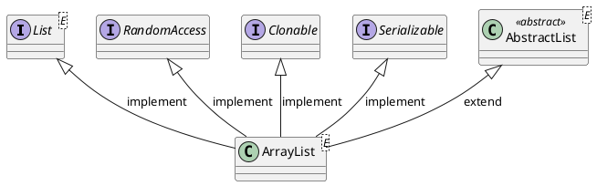

<style>
.reveal h1, .reveal h2, .reveal h3, .reveal h4, .reveal h5, .reveal h6 {
    text-transform: none;
}
.reveal .slide svg {
    background-color: white;
}
</style>

<!-- slide -->

# ArrayList

<!-- slide -->

## Inheritance Hierarchy



<!-- slide -->

## Data Structure

```puml
digraph d {

    index [shape=record,label="<0>0|<1>1|<2>2|<3>3|<4>4|<5>5|<6>6|<7>7|<8>8|<9>9",style=dotted]
    storage [shape=record,label="<0>W|<1>O|<2>R|<3>L|<4>D|<5> |<6> |<7> |<8> |<9> "]

    index:0 -> storage:0
    index:1 -> storage:1
    index:2 -> storage:2
    index:3 -> storage:3
    index:4 -> storage:4
    index:5 -> storage:5
    index:6 -> storage:6
    index:7 -> storage:7
    index:8 -> storage:8
    index:9 -> storage:9

    size [shape=none,label="size = 5"]
    capacity [shape=none,label="capacity = 10"]
    {rank=same;size,capacity}
}
```

<!-- slide -->

## Operations

* `boolean add(E e)`
* `void add(int index, E element)`
* `E get(int index)`
* `E remove(int index)`
* `E set(int index, E element)`
* `int indexOf(Object o)`

<!-- slide -->

## Time Complexity

Operation|Time Complexity
---------|---------------
add(E element)|$\mathcal{O}(1)$
add(int index, E element)|$\mathcal{O}(n)$
get(int index)|$\mathcal{O}(1)$
remove(int index)|$\mathcal{O}(n)$
set(int index, E element)|$\mathcal{O}(1)$
indexOf(Object o)|$\mathcal{O}(n)$

<!-- slide -->

## add(E e)

```puml
digraph d {

    index [shape=record,label="<0>0|<1>1|<2>2|<3>3|<4>4|<5>5|<6>6|<7>7|<8>8|<9>9",style=dotted]
    storage [shape=record,label="<0>W|<1>O|<2>R|<3>L|<4>D|<5> |<6> |<7> |<8> |<9> "]

    index:0 -> storage:0
    index:1 -> storage:1
    index:2 -> storage:2
    index:3 -> storage:3
    index:4 -> storage:4
    index:5 -> storage:5
    index:6 -> storage:6
    index:7 -> storage:7
    index:8 -> storage:8
    index:9 -> storage:9

    size [shape=none,label="size = 5"]
    capacity [shape=none,label="capacity = 10"]
    {rank=same;size,capacity}
}
```

```java
list.add('X');
```

<!-- slide -->

## add(E e)

```puml
digraph d {

    index [shape=record,label="<0>0|<1>1|<2>2|<3>3|<4>4|<5>5|<6>6|<7>7|<8>8|<9>9",style=dotted]
    storage [shape=record,label="<0>W|<1>O|<2>R|<3>L|<4>D|<5>X|<6> |<7> |<8> |<9> "]

    index:0 -> storage:0
    index:1 -> storage:1
    index:2 -> storage:2
    index:3 -> storage:3
    index:4 -> storage:4
    index:5 -> storage:5
    index:6 -> storage:6
    index:7 -> storage:7
    index:8 -> storage:8
    index:9 -> storage:9

    size [shape=none,label="size = 6",style=filled,fillcolor=orange]
    capacity [shape=none,label="capacity = 10"]
    {rank=same;size,capacity}
}
```

<!-- slide -->

## add(E e) Code

```java
public boolean add(E e) {
    ensureCapacityInternal(size + 1);  // Increments modCount!!
    elementData[size++] = e;
    return true;
}
```

<!-- slide -->

## add(E e) Time Complexity

$$
\begin{align*}
complexity &= 1+1 \\
  &= 2 \\
  &= \mathcal{O}(1)
\end{align*}
$$

<!-- slide -->

## add(E e) Benchmark

(n)|      Score | Units
----------|------------|------
10000 |  77234614.958|ops/s
100000|  58740386.300|  ops/s
1000000|  42085361.259|  ops/s
10000000|  14568270.821|  ops/s

<!-- slide -->

## add(int index, E element)

```puml
digraph d {

    index [shape=record,label="<0>0|<1>1|<2>2|<3>3|<4>4|<5>5|<6>6|<7>7|<8>8|<9>9",style=dotted]
    storage [shape=record,label="<0>W|<1>O|<2>R|<3>L|<4>D|<5> |<6> |<7> |<8> |<9> "]

    index:0 -> storage:0
    index:1 -> storage:1
    index:2 -> storage:2
    index:3 -> storage:3
    index:4 -> storage:4
    index:5 -> storage:5
    index:6 -> storage:6
    index:7 -> storage:7
    index:8 -> storage:8
    index:9 -> storage:9

    size [shape=none,label="size = 5"]
    capacity [shape=none,label="capacity = 10"]
    {rank=same;size,capacity}
}
```

```java
list.add(3,'X');
```

<!-- slide -->

## add(int index, E element)

```puml
digraph d {

    index [shape=record,label="<0>0|<1>1|<2>2|<3>3|<4>4|<5>5|<6>6|<7>7|<8>8|<9>9",style=dotted]
    storage [shape=record,label="<0>W|<1>O|<2>R|<3> |<4>L|<5>D|<6> |<7> |<8> |<9> "]

    index:0 -> storage:0
    index:1 -> storage:1
    index:2 -> storage:2
    index:3 -> storage:3
    index:4 -> storage:4
    index:5 -> storage:5
    index:6 -> storage:6
    index:7 -> storage:7
    index:8 -> storage:8
    index:9 -> storage:9

    size [shape=none,label="size = 5"]
    capacity [shape=none,label="capacity = 10"]
    {rank=same;size,capacity}
}
```

<!-- slide -->

## add(int index, E element)

```puml
digraph d {

    index [shape=record,label="<0>0|<1>1|<2>2|<3>3|<4>4|<5>5|<6>6|<7>7|<8>8|<9>9",style=dotted]
    storage [shape=record,label="<0>W|<1>O|<2>R|<3>X|<4>L|<5>D|<6> |<7> |<8> |<9> "]

    index:0 -> storage:0
    index:1 -> storage:1
    index:2 -> storage:2
    index:3 -> storage:3
    index:4 -> storage:4
    index:5 -> storage:5
    index:6 -> storage:6
    index:7 -> storage:7
    index:8 -> storage:8
    index:9 -> storage:9

    size [shape=none,label="size = 6",style=filled,fillcolor=orange]
    capacity [shape=none,label="capacity = 10"]
    {rank=same;size,capacity}
}
```

<!-- slide -->

## add(int index, E element) Code

```java
public void add(int index, E element) {
    rangeCheckForAdd(index);

    ensureCapacityInternal(size + 1);  // Increments modCount!!
    System.arraycopy(elementData, index, elementData, index + 1,
                     size - index);
    elementData[index] = element;
    size++;
}
```

<!-- slide -->

## add(int index, E element) Time Complexity

$$
\begin{align*}
complexity &= n-i \\
&= \frac{1}{n}\sum\limits_{i=0}^{n-1} (n-i) \\
&= n-\frac{n}{2}+\frac{1}{2} \\
&= \mathcal{O}(n)
\end{align*}
$$

<!-- slide -->

## add(int index, E element) Benchmark

(n)|      Score | Units
----------|------------|------
10000|    133096.896|  ops/s
100000|     93916.433|  ops/s
1000000|     15222.869|  ops/s
10000000|       543.267|  ops/s

<!-- slide -->

## get(int index)

```puml
digraph d {

    index [shape=record,label="<0>0|<1>1|<2>2|<3>3|<4>4|<5>5|<6>6|<7>7|<8>8|<9>9",style=dotted]
    storage [shape=record,label="<0>W|<1>O|<2>R|<3>L|<4>D|<5> |<6> |<7> |<8> |<9> "]

    index:0 -> storage:0
    index:1 -> storage:1
    index:2 -> storage:2
    index:3 -> storage:3
    index:4 -> storage:4
    index:5 -> storage:5
    index:6 -> storage:6
    index:7 -> storage:7
    index:8 -> storage:8
    index:9 -> storage:9

    size [shape=none,label="size = 5"]
    capacity [shape=none,label="capacity = 10"]
    {rank=same;size,capacity}
}
```

```java
list.get(3);
```

<!-- slide -->

## get(int index) Code

```java
public E get(int index) {
    rangeCheck(index);

    return elementData(index);
}
```

```java
E elementData(int index) {
    return (E) elementData[index];
}
```

<!-- slide -->

## get(int index) Time Complexity

$$
\begin{align*}
complexity &= \mathcal{O}(1)
\end{align*}
$$

<!-- slide -->

## get(int index) Benchmark

(n)|      Score | Units
----------|------------|------
10000|  13486663.625|  ops/s
100000|   9854966.665|  ops/s
1000000|   3202685.257|  ops/s
10000000|   2076313.423|  ops/s


<!-- slide -->

## remove(int index)

```puml
digraph d {

    index [shape=record,label="<0>0|<1>1|<2>2|<3>3|<4>4|<5>5|<6>6|<7>7|<8>8|<9>9",style=dotted]
    storage [shape=record,label="<0>W|<1>O|<2>R|<3>L|<4>D|<5> |<6> |<7> |<8> |<9> "]

    index:0 -> storage:0
    index:1 -> storage:1
    index:2 -> storage:2
    index:3 -> storage:3
    index:4 -> storage:4
    index:5 -> storage:5
    index:6 -> storage:6
    index:7 -> storage:7
    index:8 -> storage:8
    index:9 -> storage:9

    size [shape=none,label="size = 5"]
    capacity [shape=none,label="capacity = 10"]
    {rank=same;size,capacity}
}
```

```java
list.remove(3);
```

<!-- slide -->

## remove(int index)

```puml
digraph d {

    index [shape=record,label="<0>0|<1>1|<2>2|<3>3|<4>4|<5>5|<6>6|<7>7|<8>8|<9>9",style=dotted]
    storage [shape=record,label="<0>W|<1>O|<2>R|<3> |<4>D|<5> |<6> |<7> |<8> |<9> "]

    index:0 -> storage:0
    index:1 -> storage:1
    index:2 -> storage:2
    index:3 -> storage:3
    index:4 -> storage:4
    index:5 -> storage:5
    index:6 -> storage:6
    index:7 -> storage:7
    index:8 -> storage:8
    index:9 -> storage:9

    size [shape=none,label="size = 5"]
    capacity [shape=none,label="capacity = 10"]
    {rank=same;size,capacity}
}
```

<!-- slide -->

## remove(int index)

```puml
digraph d {

    index [shape=record,label="<0>0|<1>1|<2>2|<3>3|<4>4|<5>5|<6>6|<7>7|<8>8|<9>9",style=dotted]
    storage [shape=record,label="<0>W|<1>O|<2>R|<3>D|<4> |<5> |<6> |<7> |<8> |<9> "]

    index:0 -> storage:0
    index:1 -> storage:1
    index:2 -> storage:2
    index:3 -> storage:3
    index:4 -> storage:4
    index:5 -> storage:5
    index:6 -> storage:6
    index:7 -> storage:7
    index:8 -> storage:8
    index:9 -> storage:9

    size [shape=none,label="size = 4",style=filled,fillcolor=orange]
    capacity [shape=none,label="capacity = 10"]
    {rank=same;size,capacity}
}
```

<!-- slide -->

## remove(int index) Code

```java
public E remove(int index) {
    rangeCheck(index);

    modCount++;
    E oldValue = elementData(index);

    int numMoved = size - index - 1;
    if (numMoved > 0)
        System.arraycopy(elementData, index+1, elementData, index,
                         numMoved);
    elementData[--size] = null; // clear to let GC do its work

    return oldValue;
}
```

<!-- slide -->

## remove(int index) Time Complexity

$$
\begin{align*}
complexity &= n-i \\
&= \frac{1}{n}\sum\limits_{i=0}^{n-1} (n-i) \\
        &= n-\frac{n}{2}+\frac{1}{2} \\
        &= \mathcal{O}(n)
\end{align*}
$$

<!-- slide -->

## remove(int index) Benchmark

(n)|      Score | Units
----------|------------|------
10000|2196594.881|ops/s
100000|200273.527|ops/s
1000000|13558.748|ops/s
10000000|       738.977|  ops/s

<!-- slide -->

## set(int index, E element)

```puml
digraph d {

    index [shape=record,label="<0>0|<1>1|<2>2|<3>3|<4>4|<5>5|<6>6|<7>7|<8>8|<9>9",style=dotted]
    storage [shape=record,label="<0>W|<1>O|<2>R|<3>L|<4>D|<5> |<6> |<7> |<8> |<9> "]

    index:0 -> storage:0
    index:1 -> storage:1
    index:2 -> storage:2
    index:3 -> storage:3
    index:4 -> storage:4
    index:5 -> storage:5
    index:6 -> storage:6
    index:7 -> storage:7
    index:8 -> storage:8
    index:9 -> storage:9

    size [shape=none,label="size = 5"]
    capacity [shape=none,label="capacity = 10"]
    {rank=same;size,capacity}
}
```

```java
list.set(3,'X');
```

<!-- slide -->

## set(int index, E element)

```puml
digraph d {

    index [shape=record,label="<0>0|<1>1|<2>2|<3>3|<4>4|<5>5|<6>6|<7>7|<8>8|<9>9",style=dotted]
    storage [shape=record,label="<0>W|<1>O|<2>R|<3>X|<4>D|<5> |<6> |<7> |<8> |<9> "]

    index:0 -> storage:0
    index:1 -> storage:1
    index:2 -> storage:2
    index:3 -> storage:3
    index:4 -> storage:4
    index:5 -> storage:5
    index:6 -> storage:6
    index:7 -> storage:7
    index:8 -> storage:8
    index:9 -> storage:9

    size [shape=none,label="size = 5"]
    capacity [shape=none,label="capacity = 10"]
    {rank=same;size,capacity}
}
```

<!-- slide -->

## set(int index, E element) Code

```java
public E set(int index, E element) {
    rangeCheck(index);

    E oldValue = elementData(index);
    elementData[index] = element;
    return oldValue;
}
```

<!-- slide -->

## set(int index, E element) Time Complexity

$$
\begin{align*}
complexity &= \mathcal{O}(1)
\end{align*}
$$

<!-- slide -->

## set(int index, E element) Benchmark

(n)|      Score | Units
----------|------------|------
10000|  13493191.944|  ops/s
100000|  13126047.419|  ops/s
1000000|  12518930.786|  ops/s
10000000|   5680297.795|  ops/s

<!-- slide -->

## indexOf(Object o)

```puml
digraph d {

    index [shape=record,label="<0>0|<1>1|<2>2|<3>3|<4>4|<5>5|<6>6|<7>7|<8>8|<9>9",style=dotted]
    storage [shape=record,label="<0>W|<1>O|<2>R|<3>L|<4>D|<5> |<6> |<7> |<8> |<9> "]

    index:0 -> storage:0
    index:1 -> storage:1
    index:2 -> storage:2
    index:3 -> storage:3
    index:4 -> storage:4
    index:5 -> storage:5
    index:6 -> storage:6
    index:7 -> storage:7
    index:8 -> storage:8
    index:9 -> storage:9

    size [shape=none,label="size = 5"]
    capacity [shape=none,label="capacity = 10"]
    {rank=same;size,capacity}
}
```

```java
list.indexOf('L');
```

<!-- slide -->

## indexOf(Object 0) Code

```java
public int indexOf(Object o) {
    if (o == null) {
        for (int i = 0; i < size; i++)
            if (elementData[i]==null)
                return i;
    } else {
        for (int i = 0; i < size; i++)
            if (o.equals(elementData[i]))
                return i;
    }
    return -1;
}
```

<!-- slide -->

## indexOf(Object o) Time Complexity

$$
\begin{align*}
complexity &= i \\
&= \frac{1}{n}\sum\limits_{i=1}^{n} i \\
        &= \frac{1}{n}(\frac{n}{2}(n+1)) \\
        &= \mathcal{O}(n)
\end{align*}
$$

<!-- slide -->

## indexOf(Object o) Benchmark

(n)|      Score | Units
----------|------------|------
10000|    132575.039|  ops/s
100000|     12231.681|  ops/s
1000000|       814.599|  ops/s
10000000|        69.822|  ops/s

<!-- slide -->

## Thank You