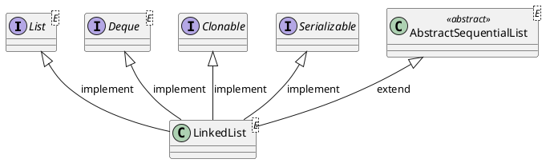

<style>
.reveal h1, .reveal h2, .reveal h3, .reveal h4, .reveal h5, .reveal h6 {
    text-transform: none;
}
.reveal .slide svg {
    background-color: white;
}
</style>

<!-- slide -->

# LinkedList

<!-- slide -->

## Inheritance Hierarchy



<!-- slide -->

## Data Structure

```puml
digraph link {
    head [shape=none,label=head]
    tail [shape=none,label=tail]

    node_a [shape=circle,label=A]
    node_b [shape=circle,label=B]
    node_c [shape=circle,label=C]
    node_d [shape=circle,label=D]

    node_a -> node_b [label=next]
    node_b -> node_a [label=previous]
    node_b -> node_c [label=next]
    node_c -> node_b [label=previous]
    node_c -> node_d [label=next]
    node_d -> node_c [label=previous]

    head -> node_a
    tail -> node_d
    {rank=same;node_a,node_b,node_c,node_d}
}
```

<!-- slide -->

## Operations

* `boolean add(E e)`
* `void add(int index, E element)`
* `E get(int index)`
* `E remove(int index)`
* `E set(int index, E element)`
* `int indexOf(Object o)`

<!-- slide -->

## Time Complexity

Operation|Time Complexity
---------|---------------
add(E element)|$\mathcal{O}(1)$
add(int index, E element)|$\mathcal{O}(n)$
get(int index)|$\mathcal{O}(n)$
remove(int index)|$\mathcal{O}(n)$
set(int index, E element)|$\mathcal{O}(n)$
indexOf(Object o)|$\mathcal{O}(n)$

<!-- slide -->

## add(E e)

```puml
digraph link {
    head [shape=none,label=head]
    tail [shape=none,label=tail]
    size [shape=none,label="size = 4"]

    node_a [shape=circle,label=A]
    node_b [shape=circle,label=B]
    node_c [shape=circle,label=C]
    node_d [shape=circle,label=D]

    node_a -> node_b [label=next]
    node_b -> node_a [label=previous]
    node_b -> node_c [label=next]
    node_c -> node_b [label=previous]
    node_c -> node_d [label=next]
    node_d -> node_c [label=previous]

    head -> node_a
    tail -> node_d
    {rank=same;node_a,node_b,node_c,node_d}
}
```

```java
list.add('X');
```

<!-- slide -->

## add(E e)

```puml
digraph link {
    head [shape=none,label=head]
    tail [shape=none,label=tail]
    size [shape=none,label="size = 4"]


    node_a [shape=circle,label=A]
    node_b [shape=circle,label=B]
    node_c [shape=circle,label=C]
    node_d [shape=circle,label=D]
    node_x [shape=circle,label=X,style=filled,fillcolor=green]

    node_a -> node_b [label=next]
    node_b -> node_a [label=previous]
    node_b -> node_c [label=next]
    node_c -> node_b [label=previous]
    node_c -> node_d [label=next]
    node_d -> node_c [label=previous]
    node_d -> node_x [label=next,color=green]
    node_x -> node_d [label=previous,color=green]

    head -> node_a
    tail -> node_d
    {rank=same;node_a,node_b,node_c,node_d,node_x}
}
```

<!-- slide -->

## add(E e)

```puml
digraph link {
    head [shape=none,label=head]
    tail [shape=none,label=tail]
    size [shape=none,label="size = 5",style=filled,fillcolor=orange]

    node_a [shape=circle,label=A]
    node_b [shape=circle,label=B]
    node_c [shape=circle,label=C]
    node_d [shape=circle,label=D]
    node_x [shape=circle,label=X,style=filled,fillcolor=green]

    node_a -> node_b [label=next]
    node_b -> node_a [label=previous]
    node_b -> node_c [label=next]
    node_c -> node_b [label=previous]
    node_c -> node_d [label=next]
    node_d -> node_c [label=previous]
    node_d -> node_x [label=next,color=green]
    node_x -> node_d [label=previous,color=green]

    head -> node_a
    tail -> node_x [color=orange]

    {rank=same;node_a,node_b,node_c,node_d,node_x}
}
```

<!-- slide -->

## add(E e) Code

```java
public boolean add(E e) {
    linkLast(e);
    return true;
}
```

```java
void linkLast(E e) {
    final Node<E> l = last;
    final Node<E> newNode = new Node<>(l, e, null);
    last = newNode;
    if (l == null)
        first = newNode;
    else
        l.next = newNode;
    size++;
    modCount++;
}
```

<!-- slide -->

## add(E e) Time Complexity

$$
\begin{align*}
complexity &= 1 + 1 \\
&= \mathcal{O}(1)
\end{align*}
$$

<!-- slide -->

## add(E e) Benchmark

(n)|      Score | Units
----------|------------|------
10000|11755253.149|ops/s
100000|11618249.660|ops/s
1000000|10409977.813|ops/s
10000000|3914456.847|ops/s

<!-- slide -->

## add(int index, E element)

```puml
digraph link {
    head [shape=none,label=head]
    tail [shape=none,label=tail]
    size [shape=none,label="size = 4"]

    node_a [shape=circle,label=A]
    node_b [shape=circle,label=B]
    node_c [shape=circle,label=C]
    node_d [shape=circle,label=D]

    node_a -> node_b [label=next]
    node_b -> node_a [label=previous]
    node_b -> node_c [label=next]
    node_c -> node_b [label=previous]
    node_c -> node_d [label=next]
    node_d -> node_c [label=previous]

    head -> node_a
    tail -> node_d
    {rank=same;node_a,node_b,node_c,node_d}
}
```

```java
list.add(2,'X');
```

<!-- slide -->

## add(int index, E element)

```puml
digraph link {
    head [shape=none,label=head]
    tail [shape=none,label=tail]
    size [shape=none,label="size = 4"]

    node_a [shape=circle,label=A]
    node_b [shape=circle,label=B]
    node_c [shape=circle,label=C]
    node_d [shape=circle,label=D]

    node_a -> node_b [label=next]
    node_b -> node_a [label=previous]
    node_b -> node_c [label=next]
    node_c -> node_b [label=previous]
    node_c -> node_d [label=next]
    node_d -> node_c [label=previous]

    head -> node_a
    tail -> node_d
    index [shape=none,label=3]
    index -> node_d [style=dotted]

    {rank=same;node_a,node_b,node_c,node_d}
    {rank=same;head,tail}
    {rank=same;index}
}
```

<!-- slide -->

## add(int index, E element)

```puml
digraph link {
    head [shape=none,label=head]
    tail [shape=none,label=tail]
    size [shape=none,label="size = 4"]

    node_a [shape=circle,label=A]
    node_b [shape=circle,label=B]
    node_c [shape=circle,label=C,style=filled,fillcolor=yellow]
    node_d [shape=circle,label=D]

    node_a -> node_b [label=next]
    node_b -> node_a [label=previous]
    node_b -> node_c [label=next]
    node_c -> node_b [label=previous]
    node_c -> node_d [label=next]
    node_d -> node_c [label=previous]

    head -> node_a
    tail -> node_d
    index [shape=none,label=2]
    index -> node_c [style=dotted]

    {rank=same;node_a,node_b,node_c,node_d}
    {rank=same;head,tail}
    {rank=same;index}
}
```

<!-- slide -->

## add(int index, E element)

```puml
digraph link {
    head [shape=none,label=head]
    tail [shape=none,label=tail]
    size [shape=none,label="size = 4"]

    node_a [shape=circle,label=A]
    node_b [shape=circle,label=B]
    node_c [shape=circle,label=C,style=filled,fillcolor=yellow]
    node_d [shape=circle,label=D]

    node_a -> node_b [label=next]
    node_b -> node_a [label=previous]
    node_b -> node_c [label=next]
    node_c -> node_b [label=previous]
    node_c -> node_d [label=next]
    node_d -> node_c [label=previous]

    head -> node_a
    tail -> node_d
    index [shape=none,label=2]
    index -> node_c [style=dotted]

    node_x [shape=circle,label=X,fillcolor=green,style=filled]

    node_x -> node_b [label=previous,color=green]
    node_x -> node_c [label=next,color=green]

    {rank=same;node_a,node_b,node_c,node_d}
    {rank=same;head,tail}
    {rank=same;index}
}
```

<!-- slide -->

## add(int index, E element)

```puml
digraph link {
    head [shape=none,label=head]
    tail [shape=none,label=tail]
    size [shape=none,label="size = 5",style=filled,fillcolor=orange]

    node_a [shape=circle,label=A]
    node_b [shape=circle,label=B]
    node_c [shape=circle,label=C,style=filled,fillcolor=yellow]
    node_d [shape=circle,label=D]

    node_a -> node_b [label=next]
    node_b -> node_a [label=previous]
    node_b -> node_x [label=next,color=orange]
    node_c -> node_x [label=previous,color=orange]
    node_c -> node_d [label=next]
    node_d -> node_c [label=previous]

    head -> node_a
    tail -> node_d
    index [shape=none,label=2]
    index -> node_c [style=dotted]

    node_x [shape=circle,label=X,style=filled,fillcolor=green]

    node_x -> node_b [label=previous,color=green]
    node_x -> node_c [label=next,color=green]

    {rank=same;node_a,node_b,node_c,node_d,node_x}
    {rank=same;head,tail}
    {rank=same;index}
}
```

<!-- slide -->

## add(int index, E element) Code

```java
public void add(int index, E element) {
    checkPositionIndex(index);
    if (index == size)
        linkLast(element);
    else
        linkBefore(element, node(index));
}
```

<!-- slide -->

## add(int index, E element) Code - node

```java
Node<E> node(int index) {
    if (index < (size >> 1)) {
        Node<E> x = first;
        for (int i = 0; i < index; i++)
            x = x.next;
        return x;
    } else {
        Node<E> x = last;
        for (int i = size - 1; i > index; i--)
            x = x.prev;
        return x;
    }
}
```

<!-- slide -->

## add(int index, E element) Code - linkBefore

```java
void linkBefore(E e, Node<E> succ) {
    // assert succ != null;
    final Node<E> pred = succ.prev;
    final Node<E> newNode = new Node<>(pred, e, succ);
    succ.prev = newNode;
    if (pred == null)
        first = newNode;
    else
        pred.next = newNode;
    size++;
    modCount++;
}
```

<!-- slide -->

## add(int index, E element) Time Complexity

$$
\begin{align*}
complexity &= i + 3 \\
&= \frac{1}{n}\sum\limits_{i=0}^{n-1}(i+3) \\
&= \frac{1}{n}(\frac{1}{2}n^2+\frac{5}{2}n) \\
&= \mathcal{O}(n)
\end{align*}
$$

<!-- slide -->

## add(int index, E element) Benchmark

(n)|Score|Units
---|-----|-----
10000|25403.366|ops/s
100000|10901.085|ops/s
1000000|1067.399|ops/s
10000000|86.488|ops/s

<!-- slide -->

## get(int index)

```puml
digraph link {
    head [shape=none,label=head]
    tail [shape=none,label=tail]
    size [shape=none,label="size = 4"]

    node_a [shape=circle,label=A]
    node_b [shape=circle,label=B]
    node_c [shape=circle,label=C]
    node_d [shape=circle,label=D]

    node_a -> node_b [label=next]
    node_b -> node_a [label=previous]
    node_b -> node_c [label=next]
    node_c -> node_b [label=previous]
    node_c -> node_d [label=next]
    node_d -> node_c [label=previous]

    head -> node_a
    tail -> node_d
    {rank=same;node_a,node_b,node_c,node_d}
}
```

```java
list.get(2);
```

<!-- slide -->

## get(int index)

```puml
digraph link {
    head [shape=none,label=head]
    tail [shape=none,label=tail]
    size [shape=none,label="size = 4"]

    node_a [shape=circle,label=A]
    node_b [shape=circle,label=B]
    node_c [shape=circle,label=C]
    node_d [shape=circle,label=D]

    node_a -> node_b [label=next]
    node_b -> node_a [label=previous]
    node_b -> node_c [label=next]
    node_c -> node_b [label=previous]
    node_c -> node_d [label=next]
    node_d -> node_c [label=previous]

    index [shape=none,label=3]

    index -> node_d [style=dotted]

    head -> node_a
    tail -> node_d
    {rank=same;node_a,node_b,node_c,node_d}
}
```

<!-- slide -->

## get(int index)

```puml
digraph link {
    head [shape=none,label=head]
    tail [shape=none,label=tail]
    size [shape=none,label="size = 4"]

    node_a [shape=circle,label=A]
    node_b [shape=circle,label=B]
    node_c [shape=circle,label=C,style=filled,fillcolor=yellow]
    node_d [shape=circle,label=D]

    node_a -> node_b [label=next]
    node_b -> node_a [label=previous]
    node_b -> node_c [label=next]
    node_c -> node_b [label=previous]
    node_c -> node_d [label=next]
    node_d -> node_c [label=previous]

    index [shape=none,label=2]

    index -> node_c [style=dotted]

    head -> node_a
    tail -> node_d
    {rank=same;node_a,node_b,node_c,node_d}
}
```

<!-- slide -->

## get(int index) Code

```java
public E get(int index) {
    checkElementIndex(index);
    return node(index).item;
}
```

```java
Node<E> node(int index) {
    if (index < (size >> 1)) {
        Node<E> x = first;
        for (int i = 0; i < index; i++)
            x = x.next;
        return x;
    } else {
        Node<E> x = last;
        for (int i = size - 1; i > index; i--)
            x = x.prev;
        return x;
    }
}
```

<!-- slide -->

## get(int index) Time Complexity

$$
\begin{align*}
complexity &= complexity_{node} \\
&= \frac{1}{n}\sum\limits_{i=1}^{n}i \\
&= \frac{1}{n}*\frac{n}{2}(n+1) \\
&= \mathcal{O}(n)
\end{align*}
$$

<!-- slide -->

## get(int index) Benchmark

(n)|Score|Units
---|-----|------
10000|213372.892|ops/s
100000|18853.990|ops/s
1000000|1083.156|ops/s
10000000|89.276|ops/s

<!-- slide -->

## remove(int index)

```puml
digraph link {
    head [shape=none,label=head]
    tail [shape=none,label=tail]
    size [shape=none,label="size = 4"]

    node_a [shape=circle,label=A]
    node_b [shape=circle,label=B]
    node_c [shape=circle,label=C]
    node_d [shape=circle,label=D]

    node_a -> node_b [label=next]
    node_b -> node_a [label=previous]
    node_b -> node_c [label=next]
    node_c -> node_b [label=previous]
    node_c -> node_d [label=next]
    node_d -> node_c [label=previous]

    head -> node_a
    tail -> node_d
    {rank=same;node_a,node_b,node_c,node_d}
}
```

```java
list.remove(2);
```

<!-- slide -->

## remove(int index)

```puml
digraph link {
    head [shape=none,label=head]
    tail [shape=none,label=tail]
    size [shape=none,label="size = 4"]

    node_a [shape=circle,label=A]
    node_b [shape=circle,label=B]
    node_c [shape=circle,label=C]
    node_d [shape=circle,label=D]

    node_a -> node_b [label=next]
    node_b -> node_a [label=previous]
    node_b -> node_c [label=next]
    node_c -> node_b [label=previous]
    node_c -> node_d [label=next]
    node_d -> node_c [label=previous]

    index [shape=none,label=3]

    index -> node_d [style=dotted]

    head -> node_a
    tail -> node_d
    {rank=same;node_a,node_b,node_c,node_d}
}
```

<!-- slide -->

## remove(int index)

```puml
digraph link {
    head [shape=none,label=head]
    tail [shape=none,label=tail]
    size [shape=none,label="size = 4"]

    node_a [shape=circle,label=A]
    node_b [shape=circle,label=B]
    node_c [shape=circle,label=C,style=filled,fillcolor=red]
    node_d [shape=circle,label=D]

    node_a -> node_b [label=next]
    node_b -> node_a [label=previous]
    node_b -> node_c [label=next]
    node_c -> node_b [label=previous]
    node_c -> node_d [label=next]
    node_d -> node_c [label=previous]

    index [shape=none,label=2]

    index -> node_c [style=dotted]

    head -> node_a
    tail -> node_d
    {rank=same;node_a,node_b,node_c,node_d}
}
```

<!-- slide -->

## remove(int index)

```puml
digraph link {
    head [shape=none,label=head]
    tail [shape=none,label=tail]
    size [shape=none,label="size = 3",style=filled,fillcolor=orange]

    node_a [shape=circle,label=A]
    node_b [shape=circle,label=B]
    node_d [shape=circle,label=D]

    node_a -> node_b [label=next]
    node_b -> node_a [label=previous]
    node_b -> node_d [label=next,color=orange]
    node_d -> node_b [label=previous,color=orange]

    head -> node_a
    tail -> node_d
    {rank=same;node_a,node_b,node_d}
}
```

<!-- slide -->

## remove(int index) Code

```java
public E remove(int index) {
    checkElementIndex(index);
    return unlink(node(index));
}
```

```java
Node<E> node(int index) {
    if (index < (size >> 1)) {
        Node<E> x = first;
        for (int i = 0; i < index; i++)
            x = x.next;
        return x;
    } else {
        Node<E> x = last;
        for (int i = size - 1; i > index; i--)
            x = x.prev;
        return x;
    }
}
```

<!-- slide -->

## remove(int index) - unlink

```java
E unlink(Node<E> x) {
    final E element = x.item;
    final Node<E> next = x.next;
    final Node<E> prev = x.prev;
    if (prev == null) {
        first = next;
    } else {
        prev.next = next;
        x.prev = null;
    }
    if (next == null) {
        last = prev;
    } else {
        next.prev = prev;
        x.next = null;
    }
    x.item = null;
    size--;
    modCount++;
    return element;
}
```

<!-- slide -->

## remove(int index) Time Complexity

$$
\begin{align*}
complexity &=complexity_{node} + 1 +1 \\
&= \mathcal{O}(n)+ 1 + 1 \\
&= \mathcal{O}(n)
\end{align*} $$

<!-- slide -->

## remove(int index) Benchmark

(n)|Score|Units
---|-----|------
10000|61985.291|ops/s
100000|12894.160|ops/s
1000000|1084.505|ops/s
10000000|91.778|ops/s

<!-- slide -->

## set(int index, E element)

```puml
digraph link {
    head [shape=none,label=head]
    tail [shape=none,label=tail]
    size [shape=none,label="size = 4"]

    node_a [shape=circle,label=A]
    node_b [shape=circle,label=B]
    node_c [shape=circle,label=C]
    node_d [shape=circle,label=D]

    node_a -> node_b [label=next]
    node_b -> node_a [label=previous]
    node_b -> node_c [label=next]
    node_c -> node_b [label=previous]
    node_c -> node_d [label=next]
    node_d -> node_c [label=previous]

    head -> node_a
    tail -> node_d
    {rank=same;node_a,node_b,node_c,node_d}
}
```

```java
list.set(2,'X')
```

<!-- slide -->

## set(int index, E element)

```puml
digraph link {
    head [shape=none,label=head]
    tail [shape=none,label=tail]
    size [shape=none,label="size = 4"]

    node_a [shape=circle,label=A]
    node_b [shape=circle,label=B]
    node_c [shape=circle,label=C]
    node_d [shape=circle,label=D]

    node_a -> node_b [label=next]
    node_b -> node_a [label=previous]
    node_b -> node_c [label=next]
    node_c -> node_b [label=previous]
    node_c -> node_d [label=next]
    node_d -> node_c [label=previous]

    index [shape=none,label=3]
    index -> node_d [style=dotted]
    head -> node_a
    tail -> node_d
    {rank=same;node_a,node_b,node_c,node_d}
}
```

<!-- slide -->

## set(int index, E element)

```puml
digraph link {
    head [shape=none,label=head]
    tail [shape=none,label=tail]
    size [shape=none,label="size = 4"]

    node_a [shape=circle,label=A]
    node_b [shape=circle,label=B]
    node_c [shape=circle,label=C,style=filled,fillcolor=yellow]
    node_d [shape=circle,label=D]

    node_a -> node_b [label=next]
    node_b -> node_a [label=previous]
    node_b -> node_c [label=next]
    node_c -> node_b [label=previous]
    node_c -> node_d [label=next]
    node_d -> node_c [label=previous]

    index [shape=none,label=2]
    index -> node_c [style=dotted]

    head -> node_a
    tail -> node_d
    {rank=same;node_a,node_b,node_c,node_d}
}
```

<!-- slide -->

## set(int index, E element)

```puml
digraph link {
    head [shape=none,label=head]
    tail [shape=none,label=tail]
    size [shape=none,label="size = 4"]

    node_a [shape=circle,label=A]
    node_b [shape=circle,label=B]
    node_c [shape=circle,label=X,style=filled,fillcolor=orange]
    node_d [shape=circle,label=D]

    node_a -> node_b [label=next]
    node_b -> node_a [label=previous]
    node_b -> node_c [label=next]
    node_c -> node_b [label=previous]
    node_c -> node_d [label=next]
    node_d -> node_c [label=previous]

    index [shape=none,label=2]
    index -> node_c [style=dotted]

    head -> node_a
    tail -> node_d
    {rank=same;node_a,node_b,node_c,node_d}
}
```

<!-- slide -->

## set(int index, E element) Code

```java
public E set(int index, E element) {
    checkElementIndex(index);
    Node<E> x = node(index);
    E oldVal = x.item;
    x.item = element;
    return oldVal;
}
```

<!-- slide -->

## set(int index, E element) Time Complexity

$$
\begin{align*}
complexity &= complexity_{node} + 1 \\
&= \mathcal{O}(n) + 1 \\
&= \mathcal{O}(n)
\end{align*}
$$

<!-- slide -->

## set(int index, E element) Benchmark

(n)|Score|Units
---|-----|------
10000|225716.975|ops/s
100000|18169.019|ops/s
1000000|1071.858|ops/s
10000000|90.422|ops/s

<!-- slide -->

## indexOf(Object o)

```puml
digraph link {
    head [shape=none,label=head]
    tail [shape=none,label=tail]
    size [shape=none,label="size = 4"]

    node_a [shape=circle,label=A]
    node_b [shape=circle,label=B]
    node_c [shape=circle,label=C]
    node_d [shape=circle,label=D]

    node_a -> node_b [label=next]
    node_b -> node_a [label=previous]
    node_b -> node_c [label=next]
    node_c -> node_b [label=previous]
    node_c -> node_d [label=next]
    node_d -> node_c [label=previous]

    head -> node_a
    tail -> node_d
    {rank=same;node_a,node_b,node_c,node_d}
}
```

```java
list.indexOf('C')
```

<!-- slide -->

## indexOf(Object o)

```puml
digraph link {
    head [shape=none,label=head]
    tail [shape=none,label=tail]
    size [shape=none,label="size = 4"]

    node_a [shape=circle,label=A]
    node_b [shape=circle,label=B]
    node_c [shape=circle,label=C]
    node_d [shape=circle,label=D]

    node_a -> node_b [label=next]
    node_b -> node_a [label=previous]
    node_b -> node_c [label=next]
    node_c -> node_b [label=previous]
    node_c -> node_d [label=next]
    node_d -> node_c [label=previous]

    index [shape=none,label=0]
    index -> node_a [style=dotted]

    head -> node_a
    tail -> node_d
    {rank=same;node_a,node_b,node_c,node_d}
}
```

<!-- slide -->

## indexOf(Object o)

```puml
digraph link {
    head [shape=none,label=head]
    tail [shape=none,label=tail]
    size [shape=none,label="size = 4"]

    node_a [shape=circle,label=A]
    node_b [shape=circle,label=B]
    node_c [shape=circle,label=C]
    node_d [shape=circle,label=D]

    node_a -> node_b [label=next]
    node_b -> node_a [label=previous]
    node_b -> node_c [label=next]
    node_c -> node_b [label=previous]
    node_c -> node_d [label=next]
    node_d -> node_c [label=previous]

    index [shape=none,label=1]
    index -> node_b [style=dotted]

    head -> node_a
    tail -> node_d
    {rank=same;node_a,node_b,node_c,node_d}
}
```

<!-- slide -->

## indexOf(Object o)

```puml
digraph link {
    head [shape=none,label=head]
    tail [shape=none,label=tail]
    size [shape=none,label="size = 4"]

    node_a [shape=circle,label=A]
    node_b [shape=circle,label=B]
    node_c [shape=circle,label=C,style=filled,fillcolor=yellow]
    node_d [shape=circle,label=D]

    node_a -> node_b [label=next]
    node_b -> node_a [label=previous]
    node_b -> node_c [label=next]
    node_c -> node_b [label=previous]
    node_c -> node_d [label=next]
    node_d -> node_c [label=previous]

    index [shape=none,label=2]
    index -> node_c [style=dotted]

    head -> node_a
    tail -> node_d
    {rank=same;node_a,node_b,node_c,node_d}
}
```

<!-- slide -->

## indexOf(Object o) Code

```java
public int indexOf(Object o) {
    int index = 0;
    if (o == null) {
        for (Node<E> x = first; x != null; x = x.next) {
            if (x.item == null)
                return index;
            index++;
        }
    } else {
        for (Node<E> x = first; x != null; x = x.next) {
            if (o.equals(x.item))
                return index;
            index++;
        }
    }
    return -1;
}
```

<!-- slide -->

## indexOf(Object o) Time Complexity

$$
\begin{align*}
complexity &= 1 +1 +i +1 \\
&= \frac{1}{n}\sum\limits_{i=1}^{n}(i+3) \\
&= \frac{1}{n}*\frac{n}{2}(n+1+3) \\
&= \frac{n}{2}+2 \\
&= \mathcal{O}(n)
\end{align*}
$$

<!-- slide -->

## indexOf(Object o) Benchmark

(n)|Score|Units
---|-----|------
10000|40496.570|ops/s
100000|3267.045|ops/s
1000000|280.220|ops/s
10000000|19.348|ops/s

<!-- slide -->

## Thank You