<style>
.reveal h1, .reveal h2, .reveal h3, .reveal h4, .reveal h5, .reveal h6 {
    text-transform: none;
}
.reveal .slide svg {
    background-color: white;
}
</style>

<!-- slide -->

# Map Interface

<!-- slide -->

## Inheritence Hierarchy

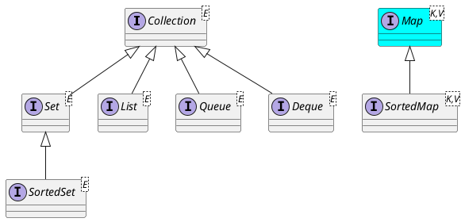

<!-- slide -->

## Logical View

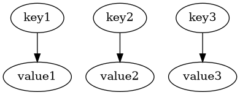

<!-- slide -->

## Basic Operations

* `V put(K key, V value)`
* `V get(Object key)`
* `V remove(Object key)`
* `boolean containsKey(Object key)`
* `boolean containsValue(Object value)`

<!-- slide -->

## V put(K key, V value)


```java
map.put("keyN","valueN");
```

<!-- slide -->

## V put(K key, V value)

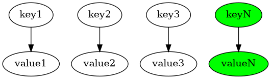

<!-- slide -->

## V get(Object key)

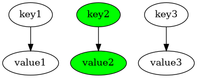

```java
map.get("key2");
```

<!-- slide -->

## V remove(Object key)

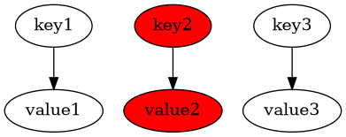

```java
map.remove("key1");
```

<!-- slide -->

## V remove(Object key)

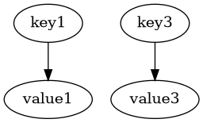

<!-- slide -->

## boolean containsKey(Object key)

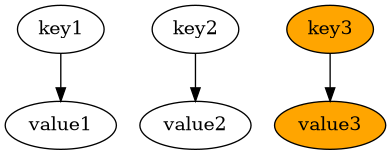

```java
map.containsKey("key3"); // is true
```

<!-- slide -->

## boolean containsValue(Object value)


```java
map.containsValue("value3"); // is true
```

<!-- slide -->

## Bulk Operations

* `void putAll(Map<? extends K, ? extends V> m)`
* `void clear()`

<!-- slide -->

## Collection Views

* `Set<K> keySet()`
* `Set<Map.Entry<K,V>> entrySet()`
* `Collection<V> values()`

<!-- slide -->

## `Set<K> keySet()`

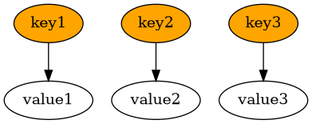

```java
map.keySet();
```

<!-- slide -->

## `Set<K> keySet()`

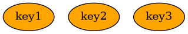

<!-- slide -->

## `Set<Map.Entry<K,V>> entrySet()`

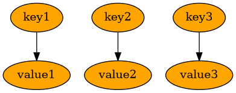

```java
map.entrySet();
```

<!-- slide -->

## `Set<Map.Entry<K,V>> entrySet()`

```puml
@startuml
digraph d {
    key1 -> value1
    key2 -> value2
    key3 -> value3

    key1 [style=filled,fillcolor=orange]
    key2 [style=filled,fillcolor=orange]
    key3 [style=filled,fillcolor=orange]
    value1 [style=filled,fillcolor=orange]
    value2 [style=filled,fillcolor=orange]
    value3 [style=filled,fillcolor=orange]

    {rank=same;key1,value1}
    {rank=same;key2,value2}
    {rank=same;key3,value3}
}
@enduml
```

<!-- slide -->

## `Collection<V> values()`

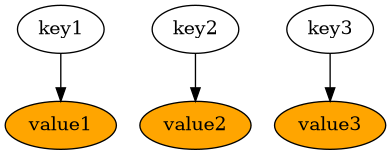

```java
map.values();
```

<!-- slide -->

## `Collection<V> values()`

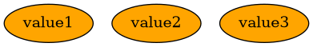

<!-- slide -->

## Implementations

* General-Purpose
    * HashMap
    * TreeMap
    * LinkedHashMap

<!-- slide -->

## Reference

* [The Map Interface](https://docs.oracle.com/javase/tutorial/collections/interfaces/map.html)
