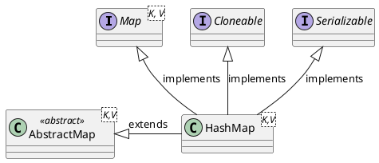

<style>
.reveal h1, .reveal h2, .reveal h3, .reveal h4, .reveal h5, .reveal h6 {
    text-transform: none;
}
.reveal .slide svg {
    background-color: white;
}
</style>

<!-- slide -->

# HashMap

<!-- slide -->

## Inheritance Hierarchy



<!-- slide -->

## Data Structure


<!-- slide -->

## Hash Function


<!-- slide -->

## Hash Function Properties

1. Determinism
2. Uniformity
3. Defined range
4. Non-invertible

<!-- slide -->

## Operations

* `V put(K key, V value)`
* `V get(Object key)`

<!-- slide -->

## V put(K key, V value)

```puml
digraph d {
    rankdir=LR
    hashtable [shape=record,label="<0>0|<1>1|<2>2|<3>3|<4>4|<5>5|<6>6|<7>7|<8>8|<9>9|...|<n>n"]

    e01 [label="k:1, v:one"]
    e11 [label="k:11, v:eleven"]
    e08 [label="k:8, v:eight"]
    e05 [label="k:5, v:five"]
    e25 [label="k:25, v:twenty-five"]
    e55 [label="k:55, v:fifty-five"]

    hashtable:1 -> e01
    e01 -> e11
    hashtable:5 -> e05
    e05 -> e25
    e25 -> e55
    hashtable:8-> e08

    {rank=different;e01,e11}
    {rank=different;e08}
    {rank=different;e05,e25,e55}
}
```

```java
map.put(38,"thirty-eight");
```

<!-- slide -->

## put - Calculate Hash Code

```puml
digraph d {
    input [label=38]
    hash_function [shape=box,label="Hash Function"]
    hash_code [label=8,style=filled,fillcolor=green]

    input -> hash_function
    hash_function -> hash_code

    {rank=same;input,hash_function,hash_code}
}
```

<!-- slide -->

## put - Find Bucket

```puml
digraph d {
    rankdir=LR
    hashtable [shape=record,label="<0>0|<1>1|<2>2|<3>3|<4>4|<5>5|<6>6|<7>7|<8>8|<9>9|...|<n>n"]

    e01 [label="k:1, v:one"]
    e11 [label="k:11, v:eleven"]
    e08 [label="k:8, v:eight"]
    e05 [label="k:5, v:five"]
    e25 [label="k:25, v:twenty-five"]
    e55 [label="k:55, v:fifty-five"]

    hashtable:1 -> e01
    e01 -> e11
    hashtable:5 -> e05
    e05 -> e25
    e25 -> e55
    hashtable:8-> e08

    {rank=different;e01,e11}
    {rank=different;e08}
    {rank=different;e05,e25,e55}

    new_hash_code [shape=none,label=8]
    new_hash_code -> hashtable:8 [style=dotted]
}
```

<!-- slide -->

## put Add Entry to Bucket

```puml
digraph d {
    rankdir=LR
    hashtable [shape=record,label="<0>0|<1>1|<2>2|<3>3|<4>4|<5>5|<6>6|<7>7|<8>8|<9>9|...|<n>n"]

    e01 [label="k:1, v:one"]
    e11 [label="k:11, v:eleven"]
    e08 [label="k:8, v:eight",style=filled,fillcolor=orange]
    e05 [label="k:5, v:five"]
    e25 [label="k:25, v:twenty-five"]
    e55 [label="k:55, v:fifty-five"]

    hashtable:1 -> e01
    e01 -> e11
    hashtable:5 -> e05
    e05 -> e25
    e25 -> e55
    hashtable:8-> e08

    {rank=different;e01,e11}
    {rank=different;e08}
    {rank=different;e05,e25,e55}

    new_hash_code [shape=none,label=8]
    new_hash_code -> hashtable:8 [style=dotted]

    e38 [label="k:38, v:thirty-eight",style=filled,fillcolor=green]
    e08 -> e38
}
```

<!-- slide -->

## put - Code

```java
public V put(K key, V value) {
    return putVal(hash(key), key, value,false, true);
}
```

<!-- slide -->

## put - Code Cont'd

```java
final V putVal(int hash, K key, V value, boolean onlyIfAbsent,
               boolean evict) {
    Node<K,V>[] tab; Node<K,V> p; int n, i;
    if ((tab = table) == null || (n = tab.length) == 0)
        n = (tab = resize()).length;
    if ((p = tab[i = (n - 1) & hash]) == null)
        tab[i] = newNode(hash, key, value, null);
    else {
```

<!-- slide -->

## put - Code Cont'd 2

```java
        Node<K,V> e; K k;
        if (p.hash == hash &&
            ((k = p.key) == key || (key != null && key.equals(k))))
            e = p;
        else if (p instanceof TreeNode)
            e = ((TreeNode<K,V>)p)
                    .putTreeVal(this, tab, hash, key, value);
        else {
            for (int binCount = 0; ; ++binCount) {
                if ((e = p.next) == null) {
                    p.next = newNode(hash, key, value, null);
                    if (binCount >= TREEIFY_THRESHOLD - 1) // -1 for 1st
                        treeifyBin(tab, hash);
                    break;
                }
                if (e.hash == hash &&
                    ((k = e.key) == key ||
                        (key != null && key.equals(k))))
                    break;
                p = e;
            }
        }
```

<!-- slide -->

## put - Code Cont'd 3

```java
        if (e != null) { // existing mapping for key
            V oldValue = e.value;
            if (!onlyIfAbsent || oldValue == null)
                e.value = value;
            afterNodeAccess(e);
            return oldValue;
        }
    }
    ++modCount;
    if (++size > threshold)
        resize();
    afterNodeInsertion(evict);
    return null;
}
```

<!-- slide -->

## put - Time Complexity

$$
\begin{align*}
complexity &= complexity_{hash} + \mathcal{O}(1) \\
&= \mathcal{O}(1) + \mathcal{O}(1) \\
&= \mathcal{O}(1)
\end{align*}
$$

<!-- slide -->

## put - Benchmark

Benchmark|(n)|Score |Units
-----------|---|------|------
put(K key, V value)|10|351401.997|ops/s
put(K key, V value)|100|356619.884|ops/s
put(K key, V value)|1000|356208.682|ops/s
put(K key, V value)|10000|351539.075|ops/s
put(K key, V value)|100000|344160.747|ops/s

<!-- slide -->

## V get(K key)

```puml
digraph d {
    rankdir=LR
    hashtable [shape=record,label="<0>0|<1>1|<2>2|<3>3|<4>4|<5>5|<6>6|<7>7|<8>8|<9>9|...|<n>n"]

    e01 [label="k:1, v:one"]
    e11 [label="k:11, v:eleven"]
    e08 [label="k:8, v:eight"]
    e05 [label="k:5, v:five"]
    e25 [label="k:25, v:twenty-five"]
    e55 [label="k:55, v:fifty-five"]

    hashtable:1 -> e01
    e01 -> e11
    hashtable:5 -> e05
    e05 -> e25
    e25 -> e55
    hashtable:8-> e08

    {rank=different;e01,e11}
    {rank=different;e08}
    {rank=different;e05,e25,e55}
}
```

```java
map.get(25);
```

<!-- slide -->

## get - Calculate Hash Code

```puml
digraph d {
    input [label=25]
    hash_function [shape=box,label="Hash Function"]
    hash_code [label=5,style=filled,fillcolor=green]

    input -> hash_function
    hash_function -> hash_code

    {rank=same;input,hash_function,hash_code}
}
```

<!-- slide -->

## get - Find Bucket

```puml
digraph d {
    rankdir=LR
    hashtable [shape=record,label="<0>0|<1>1|<2>2|<3>3|<4>4|<5>5|<6>6|<7>7|<8>8|<9>9|...|<n>n"]

    e01 [label="k:1, v:one"]
    e11 [label="k:11, v:eleven"]
    e08 [label="k:8, v:eight"]
    e05 [label="k:5, v:five"]
    e25 [label="k:25, v:twenty-five"]
    e55 [label="k:55, v:fifty-five"]

    hashtable:1 -> e01
    e01 -> e11
    hashtable:5 -> e05
    e05 -> e25
    e25 -> e55
    hashtable:8-> e08

    {rank=different;e01,e11}
    {rank=different;e08}
    {rank=different;e05,e25,e55}

    new_hash_code [shape=none,label=5]
    new_hash_code -> hashtable:5 [style=dotted]
}
```

<!-- slide -->

## get - Lookup Entry from Bucket

```puml
digraph d {
    rankdir=LR
    hashtable [shape=record,label="<0>0|<1>1|<2>2|<3>3|<4>4|<5>5|<6>6|<7>7|<8>8|<9>9|...|<n>n"]

    e01 [label="k:1, v:one"]
    e11 [label="k:11, v:eleven"]
    e08 [label="k:8, v:eight"]
    e05 [label="k:5, v:five",style=filled,fillcolor=orange]
    e25 [label="k:25, v:twenty-five"]
    e55 [label="k:55, v:fifty-five"]

    hashtable:1 -> e01
    e01 -> e11
    hashtable:5 -> e05
    e05 -> e25
    e25 -> e55
    hashtable:8-> e08

    {rank=different;e01,e11}
    {rank=different;e08}
    {rank=different;e05,e25,e55}

    new_hash_code [shape=none,label=5]
    new_hash_code -> hashtable:5 [style=dotted]
}
```

<!-- slide -->

## get - Lookup Entry from Bucket

```puml
digraph d {
    rankdir=LR
    hashtable [shape=record,label="<0>0|<1>1|<2>2|<3>3|<4>4|<5>5|<6>6|<7>7|<8>8|<9>9|...|<n>n"]

    e01 [label="k:1, v:one"]
    e11 [label="k:11, v:eleven"]
    e08 [label="k:8, v:eight"]
    e05 [label="k:5, v:five"]
    e25 [label="k:25, v:twenty-five",style=filled,fillcolor=orange]
    e55 [label="k:55, v:fifty-five"]

    hashtable:1 -> e01
    e01 -> e11
    hashtable:5 -> e05
    e05 -> e25
    e25 -> e55
    hashtable:8-> e08

    {rank=different;e01,e11}
    {rank=different;e08}
    {rank=different;e05,e25,e55}

    new_hash_code [shape=none,label=5]
    new_hash_code -> hashtable:5 [style=dotted]
}
```

<!-- slide -->

## get - Code

```java
public V get(Object key) {
    Node<K,V> e;
    return (e = getNode(hash(key), key)) == null ? null : e.value;
}
```

<!-- slide -->

## get - Code Cont'd

```java
final Node<K,V> getNode(int hash, Object key) {
    Node<K,V>[] tab; Node<K,V> first, e; int n; K k;
    if ((tab = table) != null && (n = tab.length) > 0 &&
        (first = tab[(n - 1) & hash]) != null) {
        if (first.hash == hash && // always check first node
            ((k = first.key) == key ||
                (key != null && key.equals(k))))
            return first;
        if ((e = first.next) != null) {
            if (first instanceof TreeNode)
                return ((TreeNode<K,V>)first)
                            .getTreeNode(hash, key);
            do {
                if (e.hash == hash &&
                    ((k = e.key) == key ||
                        (key != null && key.equals(k))))
                    return e;
            } while ((e = e.next) != null);
        }
    }
    return null;
}
```

<!-- slide -->

## get - Time Complexity

$$
\begin{align*}
complexity &= complexity_{hash} + \mathcal{O}(1) \\
&= \mathcal{O}(1) + \mathcal{O}(1) \\
&= \mathcal{O}(1)
\end{align*}
$$

<!-- slide -->

## get - Benchmark

Benchmark|(n)|Score|Units
---------|---|-----|-----
get(K key)|10|766467.711|ops/s
get(K key)|100|802346.553|ops/s
get(K key)|1000|790322.270|ops/s
get(K key)|10000|786963.108|ops/s
get(K key)|100000|733845.438|ops/s

<!-- slide -->

## Reference

* [Hash table](https://en.wikipedia.org/wiki/Hash_table)
* [Hash function](https://en.wikipedia.org/wiki/Hash_function)