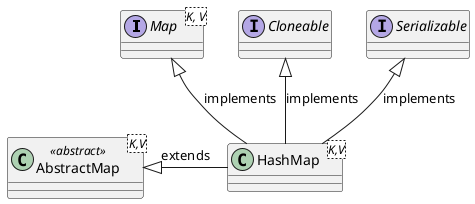

<style>
.reveal h1, .reveal h2, .reveal h3, .reveal h4, .reveal h5, .reveal h6 {
    text-transform: none;
}
.reveal .slide svg {
    background-color: white;
}
.reveal .large-table tr {
    line-height: 1;
}
</style>

<!-- slide -->

# HashMap

<!-- slide -->

## Inheritance Hierarchy



<!-- slide -->

## Data Structure


<!-- slide -->

## Hash Function


<!-- slide -->

## Hash Function Properties

1. Determinism 確定性
2. Uniformity 單調性
3. Defined range 範圍限定
4. Non-invertible 不可逆

<!-- slide -->

## Operations

* `V put(K key, V value)`
* `V remove(Object key)`
* `V get(Object key)`

<!-- slide -->

## V put(K key, V value)

```puml
digraph d {
    rankdir=LR
    hashtable [shape=record,label="<0>0|<1>1|<2>2|<3>3|<4>4|<5>5|<6>6|<7>7|<8>8|<9>9|...|<n>n"]

    e01 [label="k:1, v:one"]
    e11 [label="k:11, v:eleven"]
    e08 [label="k:8, v:eight"]
    e05 [label="k:5, v:five"]
    e25 [label="k:25, v:twenty-five"]
    e55 [label="k:55, v:fifty-five"]

    hashtable:1 -> e01
    e01 -> e11
    hashtable:5 -> e05
    e05 -> e25
    e25 -> e55
    hashtable:8-> e08

    {rank=different;e01,e11}
    {rank=different;e08}
    {rank=different;e05,e25,e55}
}
```

```java
map.put(38,"thirty-eight");
```

<!-- slide -->

## put - Calculate Hash Code

```puml
digraph d {
    input [label=38]
    hash_function [shape=box,label="Hash Function"]
    hash_code [label=8,style=filled,fillcolor=green]

    input -> hash_function
    hash_function -> hash_code

    {rank=same;input,hash_function,hash_code}
}
```

<!-- slide -->

## put - Find Bucket

```puml
digraph d {
    rankdir=LR
    hashtable [shape=record,label="<0>0|<1>1|<2>2|<3>3|<4>4|<5>5|<6>6|<7>7|<8>8|<9>9|...|<n>n"]

    e01 [label="k:1, v:one"]
    e11 [label="k:11, v:eleven"]
    e08 [label="k:8, v:eight"]
    e05 [label="k:5, v:five"]
    e25 [label="k:25, v:twenty-five"]
    e55 [label="k:55, v:fifty-five"]

    hashtable:1 -> e01
    e01 -> e11
    hashtable:5 -> e05
    e05 -> e25
    e25 -> e55
    hashtable:8-> e08

    {rank=different;e01,e11}
    {rank=different;e08}
    {rank=different;e05,e25,e55}

    new_hash_code [shape=none,label=8]
    new_hash_code -> hashtable:8 [style=dotted]
}
```

<!-- slide -->

## put Add Entry to Bucket

```puml
digraph d {
    rankdir=LR
    hashtable [shape=record,label="<0>0|<1>1|<2>2|<3>3|<4>4|<5>5|<6>6|<7>7|<8>8|<9>9|...|<n>n"]

    e01 [label="k:1, v:one"]
    e11 [label="k:11, v:eleven"]
    e08 [label="k:8, v:eight",style=filled,fillcolor=orange]
    e05 [label="k:5, v:five"]
    e25 [label="k:25, v:twenty-five"]
    e55 [label="k:55, v:fifty-five"]

    hashtable:1 -> e01
    e01 -> e11
    hashtable:5 -> e05
    e05 -> e25
    e25 -> e55
    hashtable:8-> e08

    {rank=different;e01,e11}
    {rank=different;e08}
    {rank=different;e05,e25,e55}

    new_hash_code [shape=none,label=8]
    new_hash_code -> hashtable:8 [style=dotted]

    e38 [label="k:38, v:thirty-eight",style=filled,fillcolor=green]
    e08 -> e38
}
```

<!-- slide -->

## put - Code

```java
public V put(K key, V value) {
    return putVal(hash(key), key, value,false, true);
}
```

<!-- slide -->

## put - Code 'd

```java
final V putVal(int hash, K key, V value, boolean onlyIfAbsent,
               boolean evict) {
    Node<K,V>[] tab; Node<K,V> p; int n, i;
    if ((tab = table) == null || (n = tab.length) == 0)
        n = (tab = resize()).length;
    if ((p = tab[i = (n - 1) & hash]) == null)
        tab[i] = newNode(hash, key, value, null);
    else {
```

<!-- slide -->

## put - Code Cont'd 2

```java
        Node<K,V> e; K k;
        if (p.hash == hash &&
            ((k = p.key) == key || (key != null && key.equals(k))))
            e = p;
        else if (p instanceof TreeNode)
            e = ((TreeNode<K,V>)p)
                    .putTreeVal(this, tab, hash, key, value);
        else {
            for (int binCount = 0; ; ++binCount) {
                if ((e = p.next) == null) {
                    p.next = newNode(hash, key, value, null);
                    if (binCount >= TREEIFY_THRESHOLD - 1) // -1 for 1st
                        treeifyBin(tab, hash);
                    break;
                }
                if (e.hash == hash &&
                    ((k = e.key) == key ||
                        (key != null && key.equals(k))))
                    break;
                p = e;
            }
        }
```

<!-- slide -->

## put - Time Complexity

$$
\begin{align*}
complexity &= complexity_{hash} + \mathcal{O}(1) \\
&= \mathcal{O}(1) + \mathcal{O}(1) \\
&= \mathcal{O}(1)
\end{align*}
$$

<!-- slide class="large-table" -->

## put - Benchmark

Operation|(n)|AverageTime|Unit
---------|---|-----------|----
put|10000|0.246|s/op
put|20000|0.216|s/op
put|30000|0.232|s/op
put|40000|0.222|s/op
put|50000|0.216|s/op
put|60000|0.238|s/op
put|70000|0.236|s/op
put|80000|0.205|s/op
put|90000|0.204|s/op
put|100000|0.207|s/op

<!-- slide -->

## put - Benchmark

```python {cmd=true hide=true args=["-W ignore"] matplotlib=true}
import numpy as np
from scipy.optimize import curve_fit
import matplotlib.pyplot as plt
x = np.array([10000,20000,30000,40000,50000,60000,70000,80000,90000,100000],dtype=float)
y = np.array([0.246,0.216,0.232,0.222,0.216,0.238,0.236,0.205,0.204,0.207],dtype=float)

plt.plot(x,y,'ro')
plt.ylim(np.amin(y)/10)
plt.xlabel('(n)')
plt.ylabel('AverageTime')

def bigOn(x, a, b):
    return a * x + b

def bigO1(x,a):
    return 0 * x + a

def fitAndDrawCurve(func, variables, outcomes, notation,figure):
    popt, pcov = curve_fit(func, variables, outcomes)
    handler, = figure.plot(variables, func(variables, *popt), notation, label="Fitted Curve")
    return handler

bigO1Handler = fitAndDrawCurve(bigO1,x,y,'r-',plt)

plt.legend([bigO1Handler],['y = 0 * x + a'])
plt.show() # show figre
```

<!-- slide -->

## V remove(Object key)

```puml
digraph d {
    rankdir=LR
    hashtable [shape=record,label="<0>0|<1>1|<2>2|<3>3|<4>4|<5>5|<6>6|<7>7|<8>8|<9>9|...|<n>n"]

    e01 [label="k:1, v:one"]
    e11 [label="k:11, v:eleven"]
    e08 [label="k:8, v:eight"]
    e05 [label="k:5, v:five"]
    e25 [label="k:25, v:twenty-five"]
    e55 [label="k:55, v:fifty-five"]

    hashtable:1 -> e01
    e01 -> e11
    hashtable:5 -> e05
    e05 -> e25
    e25 -> e55
    hashtable:8-> e08

    {rank=different;e01,e11}
    {rank=different;e08}
    {rank=different;e05,e25,e55}
}
```

```java
map.remove(25);
```

<!-- slide -->

## remove - Calculate Hash Code

```puml
digraph d {
    input [label=25]
    hash_function [shape=box,label="Hash Function"]
    hash_code [label=5,style=filled,fillcolor=green]

    input -> hash_function
    hash_function -> hash_code

    {rank=same;input,hash_function,hash_code}
}
```

<!-- slide -->

## remove - Find Bucket

```puml
digraph d {
    rankdir=LR
    hashtable [shape=record,label="<0>0|<1>1|<2>2|<3>3|<4>4|<5>5|<6>6|<7>7|<8>8|<9>9|...|<n>n"]

    e01 [label="k:1, v:one"]
    e11 [label="k:11, v:eleven"]
    e08 [label="k:8, v:eight"]
    e05 [label="k:5, v:five"]
    e25 [label="k:25, v:twenty-five"]
    e55 [label="k:55, v:fifty-five"]

    hashtable:1 -> e01
    e01 -> e11
    hashtable:5 -> e05
    e05 -> e25
    e25 -> e55
    hashtable:8-> e08

    {rank=different;e01,e11}
    {rank=different;e08}
    {rank=different;e05,e25,e55}

    new_hash_code [shape=none,label=5]
    new_hash_code -> hashtable:5 [style=dotted]
}
```

<!-- slide -->

## remove - Lookup Entry from Bucket

```puml
digraph d {
    rankdir=LR
    hashtable [shape=record,label="<0>0|<1>1|<2>2|<3>3|<4>4|<5>5|<6>6|<7>7|<8>8|<9>9|...|<n>n"]

    e01 [label="k:1, v:one"]
    e11 [label="k:11, v:eleven"]
    e08 [label="k:8, v:eight"]
    e05 [label="k:5, v:five",style=filled,fillcolor=orange]
    e25 [label="k:25, v:twenty-five"]
    e55 [label="k:55, v:fifty-five"]

    hashtable:1 -> e01
    e01 -> e11
    hashtable:5 -> e05
    e05 -> e25
    e25 -> e55
    hashtable:8-> e08

    {rank=different;e01,e11}
    {rank=different;e08}
    {rank=different;e05,e25,e55}

    new_hash_code [shape=none,label=5]
    new_hash_code -> hashtable:5 [style=dotted]
}
```

<!-- slide -->

## remove - Lookup Entry from Bucket

```puml
digraph d {
    rankdir=LR
    hashtable [shape=record,label="<0>0|<1>1|<2>2|<3>3|<4>4|<5>5|<6>6|<7>7|<8>8|<9>9|...|<n>n"]

    e01 [label="k:1, v:one"]
    e11 [label="k:11, v:eleven"]
    e08 [label="k:8, v:eight"]
    e05 [label="k:5, v:five"]
    e25 [label="k:25, v:twenty-five",style=filled,fillcolor=orange]
    e55 [label="k:55, v:fifty-five"]

    hashtable:1 -> e01
    e01 -> e11
    hashtable:5 -> e05
    e05 -> e25
    e25 -> e55
    hashtable:8-> e08

    {rank=different;e01,e11}
    {rank=different;e08}
    {rank=different;e05,e25,e55}

    new_hash_code [shape=none,label=5]
    new_hash_code -> hashtable:5 [style=dotted]
}
```

<!-- slide -->

## remove - Code

```java
public V remove(Object key) {
    Node<K,V> e;
    return (e = removeNode(hash(key), key, null, false, true)) == null ?
        null : e.value;
}
```

```java
static final int hash(Object key) {
    int h;
    return (key == null) ? 0 : (h = key.hashCode()) ^ (h >>> 16);
}
```

<!-- slide -->

## remove - Code Find Bucket

```java
final Node<K,V> removeNode(int hash, Object key, Object value,
                            boolean matchValue, boolean movable) {
    Node<K,V>[] tab; Node<K,V> p; int n, index;
    if ((tab = table) != null && (n = tab.length) > 0 &&
        (p = tab[index = (n - 1) & hash]) != null) {
```

<!-- slide -->

## remove - Code Address Entry

```java
        Node<K,V> node = null, e; K k; V v;
        if (p.hash == hash &&
            ((k = p.key) == key || (key != null && key.equals(k))))
            node = p;
        else if ((e = p.next) != null) {
            if (p instanceof TreeNode)
                node = ((TreeNode<K,V>)p).getTreeNode(hash, key);
            else {
                do {
                    if (e.hash == hash &&
                        ((k = e.key) == key ||
                            (key != null && key.equals(k)))) {
                        node = e;
                        break;
                    }
                    p = e;
                } while ((e = e.next) != null);
            }
        }
```

<!-- slide -->

## remove - Code Remove Entry

```java
        if (node != null && (!matchValue || (v = node.value) == value ||
                                (value != null && value.equals(v))) {
            if (node instanceof TreeNode)
                ((TreeNode<K,V>)node.removeTreeNode(this, tab,movable);
            else if (node == p)
                tab[index] = node.next;
            else
                p.next = node.next;
            ++modCount;
            --size;
            afterNodeRemoval(node);
            return node;
        }
    }
    return null;
}
```

<!-- slide -->

## remove - Time Complexity

$$
\begin{align*}
complexity &= complexity_{hash} + \mathcal{O}(1) \\
&= \mathcal{O}(1) + \mathcal{O}(1) \\
&= \mathcal{O}(1)
\end{align*}
$$

<!-- slide class="large-table" -->

## remove - Benchmark

Operation|(n)|AverageTime|Unit
---------|---|-----------|----
remove|10000|0.023|s/op
remove|20000|0.025|s/op
remove|30000|0.024|s/op
remove|40000|0.032|s/op
remove|50000|0.031|s/op
remove|60000|0.039|s/op
remove|70000|0.046|s/op
remove|80000|0.044|s/op
remove|90000|0.057|s/op
remove|100000|0.040|s/op

<!-- slide -->

## remove - Benchmark

```python {cmd=true hide=true args=["-W ignore"] matplotlib=true}
import numpy as np
from scipy.optimize import curve_fit
import matplotlib.pyplot as plt
x = np.array([10000,20000,30000,40000,50000,60000,70000,80000,90000,100000],dtype=float)
y = np.array([0.023,0.025,0.024,0.032,0.031,0.039,0.046,0.044,0.057,0.040],dtype=float)

plt.plot(x,y,'ro')
plt.ylim([0,0.5])
plt.xlabel('(n)')
plt.ylabel('AverageTime')

def bigOn(x, a, b):
    return a * x + b

def bigO1(x,a):
    return 0 * x + a

def fitAndDrawCurve(func, variables, outcomes, notation,figure):
    popt, pcov = curve_fit(func, variables, outcomes)
    handler, = figure.plot(variables, func(variables, *popt), notation, label="Fitted Curve")
    return handler

bigO1Handler = fitAndDrawCurve(bigO1,x,y,'r-',plt)

plt.legend([bigO1Handler],['y = 0 * x + a'])
plt.show() # show figre
```

<!-- slide -->

## V get(K key)

```puml
digraph d {
    rankdir=LR
    hashtable [shape=record,label="<0>0|<1>1|<2>2|<3>3|<4>4|<5>5|<6>6|<7>7|<8>8|<9>9|...|<n>n"]

    e01 [label="k:1, v:one"]
    e11 [label="k:11, v:eleven"]
    e08 [label="k:8, v:eight"]
    e05 [label="k:5, v:five"]
    e25 [label="k:25, v:twenty-five"]
    e55 [label="k:55, v:fifty-five"]

    hashtable:1 -> e01
    e01 -> e11
    hashtable:5 -> e05
    e05 -> e25
    e25 -> e55
    hashtable:8-> e08

    {rank=different;e01,e11}
    {rank=different;e08}
    {rank=different;e05,e25,e55}
}
```

```java
map.get(25);
```

<!-- slide -->

## get - Calculate Hash Code

```puml
digraph d {
    input [label=25]
    hash_function [shape=box,label="Hash Function"]
    hash_code [label=5,style=filled,fillcolor=green]

    input -> hash_function
    hash_function -> hash_code

    {rank=same;input,hash_function,hash_code}
}
```

<!-- slide -->

## get - Find Bucket

```puml
digraph d {
    rankdir=LR
    hashtable [shape=record,label="<0>0|<1>1|<2>2|<3>3|<4>4|<5>5|<6>6|<7>7|<8>8|<9>9|...|<n>n"]

    e01 [label="k:1, v:one"]
    e11 [label="k:11, v:eleven"]
    e08 [label="k:8, v:eight"]
    e05 [label="k:5, v:five"]
    e25 [label="k:25, v:twenty-five"]
    e55 [label="k:55, v:fifty-five"]

    hashtable:1 -> e01
    e01 -> e11
    hashtable:5 -> e05
    e05 -> e25
    e25 -> e55
    hashtable:8-> e08

    {rank=different;e01,e11}
    {rank=different;e08}
    {rank=different;e05,e25,e55}

    new_hash_code [shape=none,label=5]
    new_hash_code -> hashtable:5 [style=dotted]
}
```

<!-- slide -->

## get - Lookup Entry from Bucket

```puml
digraph d {
    rankdir=LR
    hashtable [shape=record,label="<0>0|<1>1|<2>2|<3>3|<4>4|<5>5|<6>6|<7>7|<8>8|<9>9|...|<n>n"]

    e01 [label="k:1, v:one"]
    e11 [label="k:11, v:eleven"]
    e08 [label="k:8, v:eight"]
    e05 [label="k:5, v:five",style=filled,fillcolor=orange]
    e25 [label="k:25, v:twenty-five"]
    e55 [label="k:55, v:fifty-five"]

    hashtable:1 -> e01
    e01 -> e11
    hashtable:5 -> e05
    e05 -> e25
    e25 -> e55
    hashtable:8-> e08

    {rank=different;e01,e11}
    {rank=different;e08}
    {rank=different;e05,e25,e55}

    new_hash_code [shape=none,label=5]
    new_hash_code -> hashtable:5 [style=dotted]
}
```

<!-- slide -->

## get - Lookup Entry from Bucket

```puml
digraph d {
    rankdir=LR
    hashtable [shape=record,label="<0>0|<1>1|<2>2|<3>3|<4>4|<5>5|<6>6|<7>7|<8>8|<9>9|...|<n>n"]

    e01 [label="k:1, v:one"]
    e11 [label="k:11, v:eleven"]
    e08 [label="k:8, v:eight"]
    e05 [label="k:5, v:five"]
    e25 [label="k:25, v:twenty-five",style=filled,fillcolor=orange]
    e55 [label="k:55, v:fifty-five"]

    hashtable:1 -> e01
    e01 -> e11
    hashtable:5 -> e05
    e05 -> e25
    e25 -> e55
    hashtable:8-> e08

    {rank=different;e01,e11}
    {rank=different;e08}
    {rank=different;e05,e25,e55}

    new_hash_code [shape=none,label=5]
    new_hash_code -> hashtable:5 [style=dotted]
}
```

<!-- slide -->

## get - Code

```java
public V get(Object key) {
    Node<K,V> e;
    return (e = getNode(hash(key), key)) == null ? null : e.value;
}
```

<!-- slide -->

## get - Code Cont'd

```java
final Node<K,V> getNode(int hash, Object key) {
    Node<K,V>[] tab; Node<K,V> first, e; int n; K k;
    if ((tab = table) != null && (n = tab.length) > 0 &&
        (first = tab[(n - 1) & hash]) != null) {
        if (first.hash == hash && // always check first node
            ((k = first.key) == key ||
                (key != null && key.equals(k))))
            return first;
        if ((e = first.next) != null) {
            if (first instanceof TreeNode)
                return ((TreeNode<K,V>)first)
                            .getTreeNode(hash, key);
            do {
                if (e.hash == hash &&
                    ((k = e.key) == key ||
                        (key != null && key.equals(k))))
                    return e;
            } while ((e = e.next) != null);
        }
    }
    return null;
}
```

<!-- slide -->

## get - Time Complexity

$$
\begin{align*}
complexity &= complexity_{hash} + \mathcal{O}(1) \\
&= \mathcal{O}(1) + \mathcal{O}(1) \\
&= \mathcal{O}(1)
\end{align*}
$$

<!-- slide class="large-table" -->

## get - Benchmark

Operation|(n)|AverageTime|Unit
---------|---|-----------|----
get|10000|0.029|s/op
get|20000|0.054|s/op
get|30000|0.026|s/op
get|40000|0.031|s/op
get|50000|0.033|s/op
get|60000|0.036|s/op
get|70000|0.046|s/op
get|80000|0.043|s/op
get|90000|0.049|s/op
get|100000|0.046|s/op

<!-- slide -->

## get - Benchmark

```python {cmd=true hide=true args=["-W ignore"] matplotlib=true}
import numpy as np
from scipy.optimize import curve_fit
import matplotlib.pyplot as plt
x = np.array([10000,20000,30000,40000,50000,60000,70000,80000,90000,100000],dtype=float)
y = np.array([0.029,0.054,0.026,0.031,0.033,0.036,0.046,0.043,0.049,0.046],dtype=float)

plt.plot(x,y,'ro')
plt.ylim([0,0.5])
plt.xlabel('(n)')
plt.ylabel('AverageTime')

def bigOn(x, a, b):
    return a * x + b

def bigO1(x,a):
    return 0 * x + a

def fitAndDrawCurve(func, variables, outcomes, notation,figure):
    popt, pcov = curve_fit(func, variables, outcomes)
    handler, = figure.plot(variables, func(variables, *popt), notation, label="Fitted Curve")
    return handler

bigO1Handler = fitAndDrawCurve(bigO1,x,y,'r-',plt)

plt.legend([bigO1Handler],['y = 0 * x + a'])
plt.show() # show figre
```

<!-- slide -->

## Thank You

<!-- slide -->

## Reference

* [Hash table](https://en.wikipedia.org/wiki/Hash_table)
* [Hash function](https://en.wikipedia.org/wiki/Hash_function)