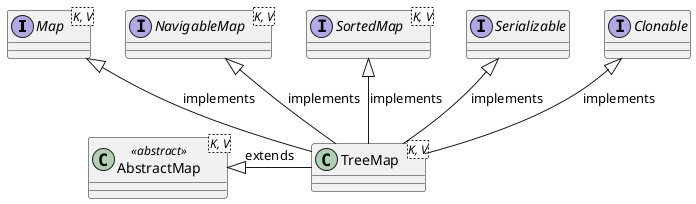

<style>
.reveal h1, .reveal h2, .reveal h3, .reveal h4, .reveal h5, .reveal h6 {
    text-transform: none;
}
.reveal .slide svg {
    background-color: white;
}
</style>

<!-- slide -->

# TreeMap

<!-- slide -->

## Inheritance Hierarchy



<!-- slide -->

## Data Structure

```puml
digraph d {
    l0 [shape=box,label=NIL,style=filled,fillcolor=black,fontcolor=white]
    n1 [shape=circle,label=1,style=filled,fillcolor=black,fontcolor=white]
    l5 [shape=boc,label=NIL,style=filled,fillcolor=black,fontcolor=white]
    n6 [shape=circle,label=6,style=filled,fillcolor=red,fontcolor=white]
    l7 [shape=box,label=NIL,style=filled,fillcolor=black,fontcolor=white]
    n8 [shape=circle,label=8,style=filled,fillcolor=red,fontcolor=white]
    l10 [shape=box,label=NIL,style=filled,fillcolor=black,fontcolor=white]
    n11 [shape=circle,label=11,style=filled,fillcolor=black,fontcolor=white]
    l12 [shape=box,label=NIL,style=filled,fillcolor=black,fontcolor=white]
    n13 [shape=circle,label=13,style=filled,fillcolor=black,fontcolor=white]
    n17 [shape=circle,label=17,style=filled,fillcolor=red,fontcolor=white]
    n15 [shape=circle,label=15,style=filled,fillcolor=black,fontcolor=white]
    l14 [shape=box,label=NIL,style=filled,fillcolor=black,fontcolor=white]
    l16 [shape=box,label=NIL,style=filled,fillcolor=black,fontcolor=white]
    n25 [shape=circle,label=25,style=filled,fillcolor=black,fontcolor=white]
    n22 [shape=circle,label=22,style=filled,fillcolor=red,fontcolor=white]
    l21 [shape=box,label=NIL,style=filled,fillcolor=black,fontcolor=white]
    l23 [shape=box,label=NIL,style=filled,fillcolor=black,fontcolor=white]
    n27 [shape=circle,label=27,style=filled,fillcolor=red,fontcolor=white]
    l26 [shape=box,label=NIL,style=filled,fillcolor=black,fontcolor=white]
    l28 [shape=box,label=NIL,style=filled,fillcolor=black,fontcolor=white]

    n13 -> n8
    n13 -> n17
    n8 -> n1
    n8 -> n11
    n1 ->l0
    n1 ->n6
    n6 -> l5
    n6 -> l7
    n11 -> l10
    n11 -> l12
    n17 -> n15
    n17 -> n25
    n15 -> l14
    n15 -> l16
    n25 -> n22
    n25 -> n27
    n22 -> l21
    n22 -> l23
    n27 -> l26
    n27 -> l28
}
```

<!-- slide -->

## Binary Search Tree Properties

1. Each node has at most two children. 任意節點最多有兩個子樹
2. All nodes of left child tree must less than parent node. 若任意節點的左子樹不空，則左子樹上所有節點的值均小於它的根節點的值
3. All nodes of righ child tree must greater than parent node. 若任意節點的右子樹不空，則右子樹上所有節點的值均大於它的根節點的值
4. Left child tree nad right child tree must be binary search tree. 任意節點的左右子樹也分別為二分搜索樹
5. No nodes with equal values. 沒有鍵值相等的節點

<!-- slide -->

## Red-Black Tree Properties

1. Each node is either red or black. 任意節點是紅色或黑色
2. The root is black. 根節點是黑色
3. All leaves (NIL) are black. 所有葉子節點都是黑色
4. if a node is red, then both its children are black. 每個紅色節點必須有兩個黑色子節點
5. Every path from a given node to any of its descendant NIL nodes contains the same number of black nodes. 從任一節點到其每個葉子節點的所有簡單路踁都包含相同數目的黑色節點

<!-- slide -->

## Basic Operations

Map|Red-Black Tree
---|--------------
`V put(K key, V value)`|insertion
`V remove(Object key)`|removal
`V get(Object key)`|binary search

<!-- slide -->

## `V put(K key, V value)`

1. binary search tree insertion
2. rebalance red-blakc tree

<!-- slide -->

## Binary Search Tree Insertion

Given tree T and value V:

1. if T is empty, then insert V as root of T 若T是空樹，則將V插入為T的根節點；
2. if V equals to value of T's root, then copy V to T's root 若V值等T的根節點的值，則將T根節點的值替換為V；
3. if V less than value of T's root, then insert V into left child of T 若V值小於T根節點的值，則將V插入左子樹；
4. insert V into right child of T (V is greater than value of T's root) 將V插入右子樹「V值大於T根節點的值」。

<!-- slide -->

## Binary Search Tree Insertion

```puml
digraph d {
    l0 [shape=box,label=NIL,style=filled,fillcolor=black,fontcolor=white]
    n1 [shape=circle,label=1,style=filled,fillcolor=black,fontcolor=white]
    l5 [shape=boc,label=NIL,style=filled,fillcolor=black,fontcolor=white]
    n6 [shape=circle,label=6,style=filled,fillcolor=red,fontcolor=white]
    l7 [shape=box,label=NIL,style=filled,fillcolor=black,fontcolor=white]
    n8 [shape=circle,label=8,style=filled,fillcolor=red,fontcolor=white]
    l10 [shape=box,label=NIL,style=filled,fillcolor=black,fontcolor=white]
    n11 [shape=circle,label=11,style=filled,fillcolor=black,fontcolor=white]
    l12 [shape=box,label=NIL,style=filled,fillcolor=black,fontcolor=white]
    n13 [shape=circle,label=13,style=filled,fillcolor=black,fontcolor=white]
    n17 [shape=circle,label=17,style=filled,fillcolor=red,fontcolor=white]
    n15 [shape=circle,label=15,style=filled,fillcolor=black,fontcolor=white]
    l14 [shape=box,label=NIL,style=filled,fillcolor=black,fontcolor=white]
    l16 [shape=box,label=NIL,style=filled,fillcolor=black,fontcolor=white]
    n25 [shape=circle,label=25,style=filled,fillcolor=black,fontcolor=white]
    n22 [shape=circle,label=22,style=filled,fillcolor=red,fontcolor=white]
    l21 [shape=box,label=NIL,style=filled,fillcolor=black,fontcolor=white]
    l23 [shape=box,label=NIL,style=filled,fillcolor=black,fontcolor=white]
    n27 [shape=circle,label=27,style=filled,fillcolor=red,fontcolor=white]
    l26 [shape=box,label=NIL,style=filled,fillcolor=black,fontcolor=white]
    l28 [shape=box,label=NIL,style=filled,fillcolor=black,fontcolor=white]

    n13 -> n8
    n13 -> n17
    n8 -> n1
    n8 -> n11
    n1 ->l0
    n1 ->n6
    n6 -> l5
    n6 -> l7
    n11 -> l10
    n11 -> l12
    n17 -> n15
    n17 -> n25
    n15 -> l14
    n15 -> l16
    n25 -> n22
    n25 -> n27
    n22 -> l21
    n22 -> l23
    n27 -> l26
    n27 -> l28
}
```

```java
tree.insert(3);
```

<!-- slide -->

## Binary Search Tree Insertion 

```puml
digraph d {
    l0 [shape=box,label=NIL,style=filled,fillcolor=black,fontcolor=white]
    n1 [shape=circle,label=1,style=filled,fillcolor=black,fontcolor=white]
    l5 [shape=boc,label=NIL,style=filled,fillcolor=black,fontcolor=white]
    n6 [shape=circle,label=6,style=filled,fillcolor=red,fontcolor=white]
    l7 [shape=box,label=NIL,style=filled,fillcolor=black,fontcolor=white]
    n8 [shape=circle,label=8,style=filled,fillcolor=red,fontcolor=white]
    l10 [shape=box,label=NIL,style=filled,fillcolor=black,fontcolor=white]
    n11 [shape=circle,label=11,style=filled,fillcolor=black,fontcolor=white]
    l12 [shape=box,label=NIL,style=filled,fillcolor=black,fontcolor=white]
    n13 [shape=circle,label=13,style=filled,fillcolor=black,fontcolor=white]
    n17 [shape=circle,label=17,style=filled,fillcolor=red,fontcolor=white]
    n15 [shape=circle,label=15,style=filled,fillcolor=black,fontcolor=white]
    l14 [shape=box,label=NIL,style=filled,fillcolor=black,fontcolor=white]
    l16 [shape=box,label=NIL,style=filled,fillcolor=black,fontcolor=white]
    n25 [shape=circle,label=25,style=filled,fillcolor=black,fontcolor=white]
    n22 [shape=circle,label=22,style=filled,fillcolor=red,fontcolor=white]
    l21 [shape=box,label=NIL,style=filled,fillcolor=black,fontcolor=white]
    l23 [shape=box,label=NIL,style=filled,fillcolor=black,fontcolor=white]
    n27 [shape=circle,label=27,style=filled,fillcolor=red,fontcolor=white]
    l26 [shape=box,label=NIL,style=filled,fillcolor=black,fontcolor=white]
    l28 [shape=box,label=NIL,style=filled,fillcolor=black,fontcolor=white]

    n13 -> n8
    n13 -> n17
    n8 -> n1
    n8 -> n11
    n1 ->l0
    n1 ->n6
    n6 -> l5
    n6 -> l7
    n11 -> l10
    n11 -> l12
    n17 -> n15
    n17 -> n25
    n15 -> l14
    n15 -> l16
    n25 -> n22
    n25 -> n27
    n22 -> l21
    n22 -> l23
    n27 -> l26
    n27 -> l28

    p [shape=none,label=pointer]

    p -> n13 [style=dotted]

    {rank=same;p,n13}
}
```

<!-- slide -->

## Binary Search Tree Insertion

```puml
digraph d {
    p [shape=none,label=pointer]
    l0 [shape=box,label=NIL,style=filled,fillcolor=black,fontcolor=white]
    n1 [shape=circle,label=1,style=filled,fillcolor=black,fontcolor=white]
    l5 [shape=boc,label=NIL,style=filled,fillcolor=black,fontcolor=white]
    n6 [shape=circle,label=6,style=filled,fillcolor=red,fontcolor=white]
    l7 [shape=box,label=NIL,style=filled,fillcolor=black,fontcolor=white]
    n8 [shape=circle,label=8,style=filled,fillcolor=red,fontcolor=white]
    l10 [shape=box,label=NIL,style=filled,fillcolor=black,fontcolor=white]
    n11 [shape=circle,label=11,style=filled,fillcolor=black,fontcolor=white]
    l12 [shape=box,label=NIL,style=filled,fillcolor=black,fontcolor=white]
    n13 [shape=circle,label=13,style=filled,fillcolor=black,fontcolor=white]
    n17 [shape=circle,label=17,style=filled,fillcolor=red,fontcolor=white]
    n15 [shape=circle,label=15,style=filled,fillcolor=black,fontcolor=white]
    l14 [shape=box,label=NIL,style=filled,fillcolor=black,fontcolor=white]
    l16 [shape=box,label=NIL,style=filled,fillcolor=black,fontcolor=white]
    n25 [shape=circle,label=25,style=filled,fillcolor=black,fontcolor=white]
    n22 [shape=circle,label=22,style=filled,fillcolor=red,fontcolor=white]
    l21 [shape=box,label=NIL,style=filled,fillcolor=black,fontcolor=white]
    l23 [shape=box,label=NIL,style=filled,fillcolor=black,fontcolor=white]
    n27 [shape=circle,label=27,style=filled,fillcolor=red,fontcolor=white]
    l26 [shape=box,label=NIL,style=filled,fillcolor=black,fontcolor=white]
    l28 [shape=box,label=NIL,style=filled,fillcolor=black,fontcolor=white]

    n13 -> n8
    n13 -> n17
    n8 -> n1
    n8 -> n11
    n1 ->l0
    n1 ->n6
    n6 -> l5
    n6 -> l7
    n11 -> l10
    n11 -> l12
    n17 -> n15
    n17 -> n25
    n15 -> l14
    n15 -> l16
    n25 -> n22
    n25 -> n27
    n22 -> l21
    n22 -> l23
    n27 -> l26
    n27 -> l28

    p -> n8 [style=dotted]

    {rank=same;p,n8}
}
```

<!-- slide -->

## Binary Search Tree Insertion

```puml
digraph d {
    p [shape=none,label=pointer]
    l0 [shape=box,label=NIL,style=filled,fillcolor=black,fontcolor=white]
    n1 [shape=circle,label=1,style=filled,fillcolor=black,fontcolor=white]
    l5 [shape=boc,label=NIL,style=filled,fillcolor=black,fontcolor=white]
    n6 [shape=circle,label=6,style=filled,fillcolor=red,fontcolor=white]
    l7 [shape=box,label=NIL,style=filled,fillcolor=black,fontcolor=white]
    n8 [shape=circle,label=8,style=filled,fillcolor=red,fontcolor=white]
    l10 [shape=box,label=NIL,style=filled,fillcolor=black,fontcolor=white]
    n11 [shape=circle,label=11,style=filled,fillcolor=black,fontcolor=white]
    l12 [shape=box,label=NIL,style=filled,fillcolor=black,fontcolor=white]
    n13 [shape=circle,label=13,style=filled,fillcolor=black,fontcolor=white]
    n17 [shape=circle,label=17,style=filled,fillcolor=red,fontcolor=white]
    n15 [shape=circle,label=15,style=filled,fillcolor=black,fontcolor=white]
    l14 [shape=box,label=NIL,style=filled,fillcolor=black,fontcolor=white]
    l16 [shape=box,label=NIL,style=filled,fillcolor=black,fontcolor=white]
    n25 [shape=circle,label=25,style=filled,fillcolor=black,fontcolor=white]
    n22 [shape=circle,label=22,style=filled,fillcolor=red,fontcolor=white]
    l21 [shape=box,label=NIL,style=filled,fillcolor=black,fontcolor=white]
    l23 [shape=box,label=NIL,style=filled,fillcolor=black,fontcolor=white]
    n27 [shape=circle,label=27,style=filled,fillcolor=red,fontcolor=white]
    l26 [shape=box,label=NIL,style=filled,fillcolor=black,fontcolor=white]
    l28 [shape=box,label=NIL,style=filled,fillcolor=black,fontcolor=white]

    n13 -> n8
    n13 -> n17
    n8 -> n1
    n8 -> n11
    n1 ->l0
    n1 ->n6
    n6 -> l5
    n6 -> l7
    n11 -> l10
    n11 -> l12
    n17 -> n15
    n17 -> n25
    n15 -> l14
    n15 -> l16
    n25 -> n22
    n25 -> n27
    n22 -> l21
    n22 -> l23
    n27 -> l26
    n27 -> l28

    p -> n1 [style=dotted]

    {rank=same;p,n1}
}
```

<!-- slide -->

## Binary Search Tree Insertion

```puml
digraph d {
    
    l0 [shape=box,label=NIL,style=filled,fillcolor=black,fontcolor=white]
    n1 [shape=circle,label=1,style=filled,fillcolor=black,fontcolor=white]
    l5 [shape=boc,label=NIL,style=filled,fillcolor=black,fontcolor=white]
    n6 [shape=circle,label=6,style=filled,fillcolor=red,fontcolor=white]
    l7 [shape=box,label=NIL,style=filled,fillcolor=black,fontcolor=white]
    n8 [shape=circle,label=8,style=filled,fillcolor=red,fontcolor=white]
    l10 [shape=box,label=NIL,style=filled,fillcolor=black,fontcolor=white]
    n11 [shape=circle,label=11,style=filled,fillcolor=black,fontcolor=white]
    l12 [shape=box,label=NIL,style=filled,fillcolor=black,fontcolor=white]
    n13 [shape=circle,label=13,style=filled,fillcolor=black,fontcolor=white]
    n17 [shape=circle,label=17,style=filled,fillcolor=red,fontcolor=white]
    n15 [shape=circle,label=15,style=filled,fillcolor=black,fontcolor=white]
    l14 [shape=box,label=NIL,style=filled,fillcolor=black,fontcolor=white]
    l16 [shape=box,label=NIL,style=filled,fillcolor=black,fontcolor=white]
    n25 [shape=circle,label=25,style=filled,fillcolor=black,fontcolor=white]
    n22 [shape=circle,label=22,style=filled,fillcolor=red,fontcolor=white]
    l21 [shape=box,label=NIL,style=filled,fillcolor=black,fontcolor=white]
    l23 [shape=box,label=NIL,style=filled,fillcolor=black,fontcolor=white]
    n27 [shape=circle,label=27,style=filled,fillcolor=red,fontcolor=white]
    l26 [shape=box,label=NIL,style=filled,fillcolor=black,fontcolor=white]
    l28 [shape=box,label=NIL,style=filled,fillcolor=black,fontcolor=white]
    p [shape=none,label=pointer]

    n13 -> n8
    n13 -> n17
    n8 -> n1
    n8 -> n11
    n1 ->l0
    n1 ->n6
    n6 -> l5
    n6 -> l7
    n11 -> l10
    n11 -> l12
    n17 -> n15
    n17 -> n25
    n15 -> l14
    n15 -> l16
    n25 -> n22
    n25 -> n27
    n22 -> l21
    n22 -> l23
    n27 -> l26
    n27 -> l28

    n6 -> p [style=dotted,arrowhead=none,arrowtail=normal]

    {rank=same;p,n6}
}
```

<!-- slide -->

## Binary Search Tree Insertion

```puml
digraph d {
    p [shape=none,label=pointer]
    l0 [shape=box,label=NIL,style=filled,fillcolor=black,fontcolor=white]
    n1 [shape=circle,label=1,style=filled,fillcolor=black,fontcolor=white]
    l2 [shape=box,label=NIL,style=filled,fillcolor=black,fontcolor=white]
    n3 [shape=circle,label=3,style=filled,fillcolor=red,fontcolor=white]
    l5 [shape=boc,label=NIL,style=filled,fillcolor=black,fontcolor=white]
    n6 [shape=circle,label=6,style=filled,fillcolor=red,fontcolor=white]
    l7 [shape=box,label=NIL,style=filled,fillcolor=black,fontcolor=white]
    n8 [shape=circle,label=8,style=filled,fillcolor=red,fontcolor=white]
    l10 [shape=box,label=NIL,style=filled,fillcolor=black,fontcolor=white]
    n11 [shape=circle,label=11,style=filled,fillcolor=black,fontcolor=white]
    l12 [shape=box,label=NIL,style=filled,fillcolor=black,fontcolor=white]
    n13 [shape=circle,label=13,style=filled,fillcolor=black,fontcolor=white]
    n17 [shape=circle,label=17,style=filled,fillcolor=red,fontcolor=white]
    n15 [shape=circle,label=15,style=filled,fillcolor=black,fontcolor=white]
    l14 [shape=box,label=NIL,style=filled,fillcolor=black,fontcolor=white]
    l16 [shape=box,label=NIL,style=filled,fillcolor=black,fontcolor=white]
    n25 [shape=circle,label=25,style=filled,fillcolor=black,fontcolor=white]
    n22 [shape=circle,label=22,style=filled,fillcolor=red,fontcolor=white]
    l21 [shape=box,label=NIL,style=filled,fillcolor=black,fontcolor=white]
    l23 [shape=box,label=NIL,style=filled,fillcolor=black,fontcolor=white]
    n27 [shape=circle,label=27,style=filled,fillcolor=red,fontcolor=white]
    l26 [shape=box,label=NIL,style=filled,fillcolor=black,fontcolor=white]
    l28 [shape=box,label=NIL,style=filled,fillcolor=black,fontcolor=white]

    n13 -> n8
    n13 -> n17
    n8 -> n1
    n8 -> n11
    n1 ->l0
    n1 ->n6
    n3 ->l2
    n3 ->l5
    n6 -> n3
    n6 -> l7
    n11 -> l10
    n11 -> l12
    n17 -> n15
    n17 -> n25
    n15 -> l14
    n15 -> l16
    n25 -> n22
    n25 -> n27
    n22 -> l21
    n22 -> l23
    n27 -> l26
    n27 -> l28

    p -> n3 [style=dotted]

    {rank=same;p,n3}
}
```

<!-- slide -->

## Rebalance Cases

1. The current node **N** is at the root of the tree. 當前節點是紅黑樹的根節點
2. The current node's parent **P** is black. 當前節點的父節點是黑色的
3. Both the parent **P** and the uncle **U** are red. 父節點和叔父節點都是紅色的
4. The parent **P** is red but the uncle is black. 父節點是紅色的，但叔父節點是黑色的

<!-- slide -->

## Case 1

```puml
digraph d {
    l1 [shape=triangle,label=1]
    n [sahpe=circle,label=N,style=filled,fillcolor=red,fontcolor=white]
    l2 [shape=triangle,label=2]

    n -> l1
    n -> l2
}
```

```puml
digraph d {
    l1 [shape=triangle,label=1]
    n [sahpe=circle,label=N,style=filled,fillcolor=black,fontcolor=white]
    l2 [shape=triangle,label=2]

    n -> l1
    n -> l2
}
```

<!-- slide -->

## Case 1 - Code

```java
private void fixAfterInsertion(Entry<K,V> x) {
    x.color = RED;
    ...
    root.color = BLACK;
}
```

<!-- slide -->

## Case 2

```puml
digraph d {
    t1 [shape=triangle,label=1]
    n [shape=circle,label=N,style=filled,fillcolor=red,fontcolor=white]
    t2 [shape=triangle,label=2]
    p [shape=circle,label=P,style=filled,fillcolor=black,fontcolor=white]
    t3 [shape=triangle,label=3]
    s [shape=circle,label=S,style=filled,fillcolor=red,fontcolor=white]
    t4 [shape=triangle,label=4]

    p -> n
    p -> s
    n -> t1
    n -> t2
    s -> t3
    s -> t4
}
```

<!-- slide -->

## Case 3

```puml
digraph d {
    t1 [shape=triangle,label=1]
    n [shape=circle,label=N,style=filled,fillcolor=red,fontcolor=white]
    t2 [shape=triangle,label=2]
    p [shape=circle,label=P,style=filled,fillcolor=red,fontcolor=white]
    t3 [shape=triangle,label=3]
    g [shape=circle,label=G,style=filled,fillcolor=black,fontcolor=white]
    t4 [shape=triangle,label=4]
    u [shape=circle,label=U,style=filled,fillcolor=red,fontcolor=white]
    t5 [shape=triangle,label=5]

    g -> p
    g -> u
    p -> n
    p -> t3
    n -> t1
    n -> t2
    u -> t4
    u -> t5
}
```

<!-- slide -->

## Case 3

```puml
digraph d {
    t1 [shape=triangle,label=1]
    n [shape=circle,label=N,style=filled,fillcolor=red,fontcolor=white]
    t2 [shape=triangle,label=2]
    p [shape=circle,label=P,style=filled,fillcolor=black,fontcolor=white]
    t3 [shape=triangle,label=3]
    g [shape=circle,label=G,style=filled,fillcolor=red,fontcolor=white]
    t4 [shape=triangle,label=4]
    u [shape=circle,label=U,style=filled,fillcolor=black,fontcolor=white]
    t5 [shape=triangle,label=5]

    g -> p
    g -> u
    p -> n
    p -> t3
    n -> t1
    n -> t2
    u -> t4
    u -> t5
}
```

<!-- slide -->

## Case 3 - Code

```java
private void fixAfterInsertion(Entry<K,V> x) {
    ...
    while (x != null && x != root && x.parent.color == RED) {
        if (parentOf(x) == leftOf(parentOf(parentOf(x)))) {
            Entry<K,V> y = rightOf(parentOf(parentOf(x)));
            if (colorOf(y) == RED) {
                setColor(parentOf(x), BLACK);
                setColor(y, BLACK);
                setColor(parentOf(parentOf(x)), RED);
                x = parentOf(parentOf(x));
            } else {...}
        } else {
            Entry<K,V> y = leftOf(parentOf(parentOf(x)));
            if (colorOf(y) == RED) {
                setColor(parentOf(x), BLACK);
                setColor(y, BLACK);
                setColor(parentOf(parentOf(x)), RED);
                x = parentOf(parentOf(x));
            } else {...}
        }
    }
    ...
}
```

<!-- slide -->

## Case 4

```puml
digraph d {
    t1 [shape=triangle,label=1]
    n [shape=circle,label=N,style=filled,fillcolor=red,fontcolor=white]
    t2 [shape=triangle,label=2]
    p [shape=circle,label=P,style=filled,fillcolor=red,fontcolor=white]
    t3 [shape=triangle,label=3]
    g [shape=circle,label=G,style=filled,fillcolor=black,fontcolor=white]
    t4 [shape=triangle,label=4]
    u [shape=circle,label=U,style=filled,fillcolor=black,fontcolor=white]
    t5 [shape=triangle,label=5]

    g -> p
    g -> u
    p -> t1
    p -> n
    n -> t2
    n -> t3
    u -> t4
    u -> t5
}
```

<!-- slide -->

## Rotate Left

```puml
digraph d {
    p [label=P]
    n [label=N]
    nl [label=<N<SUB>L</SUB>>]
    nr [label=<N<SUB>R</SUB>>]
    l5 [shape=triangle,label=5]
    l6 [shape=triangle,label=6]

    p -> n
    n -> nl
    n -> nr
    nr -> l5
    nr -> l6

    n -> l5 [style=dotted]
    l5 -> nr [style=dotted]
    nr -> n [style=dotted]
}
```

<!-- slide -->

## Rotate Left

```puml
digraph d {
    p [label=P]
    n [label=N]
    nl [label=<N<SUB>L</SUB>>]
    nr [label=<N<SUB>R</SUB>>]
    l5 [shape=triangle,label=5]
    l6 [shape=triangle,label=6]

    p -> nr
    n -> nl
    n -> l5
    nr -> n
    nr -> l6
}
```

<!-- slide -->

## Rotate Right

```puml
digraph d {
    p [label=P]
    n [label=N]
    nl [label=<N<SUB>L</SUB>>]
    nr [label=<N<SUB>R</SUB>>]
    l3 [shape=triangle,label=3]
    l4 [shape=triangle,label=4]

    p -> n
    n -> nl
    n -> nr
    nl -> l3
    nl -> l4

    n -> l4 [style=dotted]
    nl -> n [style=dotted]
    l4 -> nl [style=dotted]
}
```

<!-- slide -->

## Rotate Right

```puml
digraph d {
    p [label=P]
    l3 [shape=triangle,label=3]
    nl [label=<N<SUB>L</SUB>>]
    l4 [shape=triangle,label=4]
    nr [label=<N<SUB>R</SUB>>]
    n [label=N]

    p -> nl
    n -> l4
    n -> nr
    nl -> l3
    nl -> n

}
```

<!-- slide -->

## Case 4: step 1

```puml
digraph d {
    t1 [shape=triangle,label=1]
    n [shape=circle,label=N,style=filled,fillcolor=red,fontcolor=white]
    t2 [shape=triangle,label=2]
    p [shape=circle,label=P,style=filled,fillcolor=red,fontcolor=white]
    t3 [shape=triangle,label=3]
    g [shape=circle,label=G,style=filled,fillcolor=black,fontcolor=white]
    t4 [shape=triangle,label=4]
    u [shape=circle,label=U,style=filled,fillcolor=black,fontcolor=white]
    t5 [shape=triangle,label=5]

    g -> n
    g -> u
    p -> t1
    p -> t2
    n -> p
    n -> t3
    u -> t4
    u -> t5
}
```

<!-- slide -->

## Case 4: step 2

```puml
digraph d {
    t1 [shape=triangle,label=1]
    p [shape=circle,label=P,style=filled,fillcolor=red,fontcolor=white]
    t2 [shape=triangle,label=2]
    n [shape=circle,label=N,style=filled,fillcolor=black,fontcolor=white]
    t3 [shape=triangle,label=3]
    g [shape=circle,label=G,style=filled,fillcolor=red,fontcolor=white]
    t4 [shape=triangle,label=4]
    u [shape=circle,label=U,style=filled,fillcolor=black,fontcolor=white]
    t5 [shape=triangle,label=5]

    n -> p
    n -> g
    p -> t1
    p -> t2
    g -> t3
    g -> u
    u -> t4
    u -> t5
}
```

<!-- slide -->

## Put - Time Complexity

$$
\begin{align*}
complexity &= \mathcal{O}(\log_2 n) + \mathcal{O}(1) \\
&= \mathcal{O}(\log_2 n)
\end{align*}
$$

<!-- slide -->

## Put - Benchmark

Operation|(n)|Score|Unit
---------|---|-----|----
put|10|252056.985|ops/s
put|100|253333.101|ops/s
put|1000|250185.857|ops/s
put|10000|251693.733|ops/s
put|100000|235505.735|ops/s

<!-- slide -->

## Remove

1. remove from binary search tree
2. rebalance red-black tree

<!-- slide -->

## Remove from Binary Search Tree

* case 1: **M** has no child
* case 2: **M** has one child
* case 3: **M** has two children

<!-- slide -->

## Case 1: **M** has no child

```puml
digraph d {
    p [label=P]
    m [label=M,style=filled,fillcolor=red,fontcolor=white]
    s [label=S]
    p -> m
    p -> s
}
```

```puml
digraph d {
    p [label=P]
    m [shape=none,label=""]
    s [label=S]
    p -> m [color=white]
    p -> s
}
```

<!-- slide -->

## Case 2: **M** has one child

```puml
digraph d {
    p [label=P]
    m [label=M,style=filled,fillcolor=red,fontcolor=white]
    s [label=S]
    cl [label=<C<SUB>L</SUB>>]
    p -> m
    p -> s
    m -> cl
}
```

```puml
digraph d {
    p [label=P]
    cl [label=<C<SUB>L</SUB>>]
    s [label=S]

    p -> cl
    p -> s
}
```

<!-- slide -->

## Case 3: **M** has two children

```puml
digraph d {
    p [label=P]
    m [label=M,style=filled,fillcolor=red,fontcolor=white]
    cl [label=<C<SUB>L</SUB>>]
    d [label=D]
    e [label=E]
    cr [label=<C<SUB>R</SUB>>]
    f [shape=none,label=""]
    g [label=G]
    h [label=H]
    i [label=I]
    s [label=S]
    p -> m
    p -> s
    m -> cl
    m -> cr
    cl -> d
    cl -> e
    cr -> g
    cr -> i
    g -> f [color=white]
    g -> h
}
```

<!-- slide -->

## Case 3: **M** has two children

```puml
digraph d {
    p [label=P]
    cl [label=<C<SUB>L</SUB>>]
    d [label=D]
    e [label=E]
    cr [label=<C<SUB>R</SUB>>]
    f [shape=none,label=""]
    g [label=G,style=filled,fillcolor=orange,fontcolor=white]
    h [label=H]
    i [label=I]
    s [label=S]
    p -> g
    p -> s
    g -> cl
    g -> cr
    cl -> d
    cl -> e
    cr -> h
    cr -> i
}
```

<!-- slide -->

## Removal - Rebalance

* case 1: **M** is black but **N** is red
* case 2: **N** is root
* case 3: **S** is red
* case 4: **P**, **S**, $S_{L}$ and $S_{R}$ all are black
* case 5: **P** is red, but **S**, $S_{L}$ and $S_{R}$ are black
* case 6: **S** is black and $S_{L}$ and $S_{R}$ are in different color
* case 7: other

<!-- slide -->

## Case 1: **M** is black but **N** is red

```java
private void fixAfterDeletion(Entry<K,V> x) {
    ...
    setColor(x, BLACK);
}
```

<!-- slide -->

## Case 2: **N** is root

```java
private void fixAfterDeletion(Entry<K,V> x) {
    while (x != root && colorOf(x) == BLACK) {
        ...
    }
    setColor(x, BLACK);
}
```

<!-- slide -->

## Case 3: **S** is red - digram

```puml
digraph d {
    l1 [shape=triangle,label=1]
    N [style=filled,fillcolor=black,fontcolor=white]
    l2 [shape=triangle,label=2]
    P [style=filled,fillcolor=black,fontcolor=white]
    S [style=filled,fillcolor=red,fontcolor=white]
    l3 [shape=triangle,label=3]
    SL [style=filled,fillcolor=black,fontcolor=white,label=<S<SUB>L</SUB>>]
    l4 [shape=triangle,label=4]
    l5 [shape=triangle,label=5]
    SR [style=filled,fillcolor=black,fontcolor=white,label=<S<SUB>R</SUB>>]
    l6 [shape=triangle,label=6]

    P -> N
    P -> S
    N -> l1
    N -> l2
    S -> SL
    S -> SR
    SL -> l3 [arrowhead=dot]
    SL -> l4 [arrowhead=dot]
    SR -> l5 [arrowhead=dot]
    SR -> l6 [arrowhead=dot]
}
```

<!-- slide -->

## Case 3: **S** is red - diagram

```puml
digraph d {
    l1 [shape=triangle,label=1]
    N [style=filled,fillcolor=black,fontcolor=white]
    l2 [shape=triangle,label=2]
    P [style=filled,fillcolor=red,fontcolor=white]
    S [style=filled,fillcolor=black,fontcolor=white]
    l3 [shape=triangle,label=3]
    SL [style=filled,fillcolor=black,fontcolor=white,label=<S<SUB>L</SUB>>]
    l4 [shape=triangle,label=4]
    l5 [shape=triangle,label=5]
    SR [style=filled,fillcolor=black,fontcolor=white,label=<S<SUB>R</SUB>>]
    l6 [shape=triangle,label=6]

    S -> P
    S -> SR
    P -> N
    N -> l1 
    N -> l2
    P -> SL
    SL -> l3 [arrowhead=dot]
    SL -> l4 [arrowhead=dot]
    SR -> l5 [arrowhead=dot]
    SR -> l6 [arrowhead=dot]
}
```

<!-- slide -->

## Case 3: **S** is red

```java
private void fixAfterDeletion(Entry<K,V> x) {
    while (x != root && colorOf(x) == BLACK) {
        if (x == leftOf(parentOf(x))) {
            Entry<K,V> sib = rightOf(parentOf(x));

            if (colorOf(sib) == RED) {
                setColor(sib, BLACK);
                setColor(parentOf(x), RED);
                rotateLeft(parentOf(x));
                sib = rightOf(parentOf(x));
            }
            ...
        } else { // symmetric
            Entry<K,V> sib = leftOf(parentOf(x));

            if (colorOf(sib) == RED) {
                setColor(sib, BLACK);
                setColor(parentOf(x), RED);
                rotateRight(parentOf(x));
                sib = leftOf(parentOf(x));
            }
            ...
        }
    }
    ...
}
```

<!-- slide -->

## Case 4: **P**, **S**, $S_{L}$ and $S_{R}$ all are black - diagram

```puml
digraph d {
    l1 [shape=triangle,label=1]
    N [style=filled,fillcolor=black,fontcolor=white]
    l2 [shape=triangle,label=2]
    P [style=filled,fillcolor=black,fontcolor=white]
    S [style=filled,fillcolor=black,fontcolor=white]
    l3 [shape=triangle,label=3]
    SL [style=filled,fillcolor=black,fontcolor=white,label=<S<SUB>L</SUB>>]
    l4 [shape=triangle,label=4]
    l5 [shape=triangle,label=5]
    SR [style=filled,fillcolor=black,fontcolor=white,label=<S<SUB>R</SUB>>]
    l6 [shape=triangle,label=6]

    P -> N
    P -> S
    N -> l1
    N -> l2
    S -> SL
    S -> SR
    SL -> l3 [arrowhead=dot]
    SL -> l4 [arrowhead=dot]
    SR -> l5 [arrowhead=dot]
    SR -> l6 [arrowhead=dot]
}
```

<!-- slide -->

## Case 4: **P**, **S**, $S_{L}$ and $S_{R}$ all are black - diagram

```puml
digraph d {
    l1 [shape=triangle,label=1]
    N [style=filled,fillcolor=black,fontcolor=white]
    l2 [shape=triangle,label=2]
    P [style=filled,fillcolor=black,fontcolor=white]
    S [style=filled,fillcolor=red,fontcolor=white]
    l3 [shape=triangle,label=3]
    SL [style=filled,fillcolor=black,fontcolor=white,label=<S<SUB>L</SUB>>]
    l4 [shape=triangle,label=4]
    l5 [shape=triangle,label=5]
    SR [style=filled,fillcolor=black,fontcolor=white,label=<S<SUB>R</SUB>>]
    l6 [shape=triangle,label=6]

    P -> N
    P -> S
    N -> l1
    N -> l2
    S -> SL
    S -> SR
    SL -> l3 [arrowhead=dot]
    SL -> l4 [arrowhead=dot]
    SR -> l5 [arrowhead=dot]
    SR -> l6 [arrowhead=dot]
}
```

<!-- slide -->

## Case 4: Code

```java
private void fixAfterDeletion(Entry<K,V> x) {
    while (x != root && colorOf(x) == BLACK) {
        if (x == leftOf(parentOf(x))) {
            Entry<K,V> sib = rightOf(parentOf(x));
            ...
            if (colorOf(leftOf(sib))  == BLACK &&
                colorOf(rightOf(sib)) == BLACK) {
                setColor(sib, RED);
                x = parentOf(x);
            } else {...}
        } else { // symmetric
            Entry<K,V> sib = leftOf(parentOf(x));
            ...
            if (colorOf(rightOf(sib)) == BLACK &&
                colorOf(leftOf(sib)) == BLACK) {
                setColor(sib, RED);
                x = parentOf(x);
            } else {...}
        }
    }
    setColor(x, BLACK);
}
```

<!-- slide -->

## Case 5: **P** is red, but **S**, $S_{L}$ and $S_{R}$ are black

```puml
digraph d {
    l1 [shape=triangle,label=1]
    N [style=filled,fillcolor=black,fontcolor=white]
    l2 [shape=triangle,label=2]
    P [style=filled,fillcolor=red,fontcolor=white]
    S [style=filled,fillcolor=black,fontcolor=white]
    l3 [shape=triangle,label=3]
    SL [style=filled,fillcolor=black,fontcolor=white,label=<S<SUB>L</SUB>>]
    l4 [shape=triangle,label=4]
    l5 [shape=triangle,label=5]
    SR [style=filled,fillcolor=black,fontcolor=white,label=<S<SUB>R</SUB>>]
    l6 [shape=triangle,label=6]

    P -> N
    P -> S
    N -> l1
    N -> l2
    S -> SL
    S -> SR
    SL -> l3 [arrowhead=dot]
    SL -> l4 [arrowhead=dot]
    SR -> l5 [arrowhead=dot]
    SR -> l6 [arrowhead=dot]
}
```

<!-- slide -->

## Case 5: **P** is red, but **S**, $S_{L}$ and $S_{R}$ are black

```puml
digraph d {
    l1 [shape=triangle,label=1]
    N [style=filled,fillcolor=black,fontcolor=white]
    l2 [shape=triangle,label=2]
    P [style=filled,fillcolor=black,fontcolor=white]
    S [style=filled,fillcolor=red,fontcolor=white]
    l3 [shape=triangle,label=3]
    SL [style=filled,fillcolor=black,fontcolor=white,label=<S<SUB>L</SUB>>]
    l4 [shape=triangle,label=4]
    l5 [shape=triangle,label=5]
    SR [style=filled,fillcolor=black,fontcolor=white,label=<S<SUB>R</SUB>>]
    l6 [shape=triangle,label=6]

    P -> N
    P -> S
    N -> l1
    N -> l2
    S -> SL
    S -> SR
    SL -> l3 [arrowhead=dot]
    SL -> l4 [arrowhead=dot]
    SR -> l5 [arrowhead=dot]
    SR -> l6 [arrowhead=dot]
}
```

<!-- slide -->

## Case 5: **P** is red, but **S**, $S_{L}$ and $S_{R}$ are black

covered by code of case 4


<!-- slide -->

## Case 6: **S** is black and $S_{L}$ and $S_{R}$ are in different color

```puml
digraph d {
    l1 [shape=triangle,label=1]
    SL [style=filled,fillcolor=red,fontcolor=white,label=<S<SUB>L</SUB>>]
    l2 [shape=triangle,label=2]
    S [style=filled,fillcolor=black,fontcolor=white]
    l3 [shape=triangle,label=3]
    SR [style=filled,fillcolor=black,fontcolor=white,label=<S<SUB>R</SUB>>]
    l4 [shape=triangle,label=4]

    S -> SL
    S -> SR
    SL -> l1 [arrowhead=dot]
    SL -> l2 [arrowhead=dot]
    SR -> l3
    SR -> l4
}
```

<!-- slide -->

## Case 6: **S** is black and $S_{L}$ and $S_{R}$ are in different color

```puml
digraph d {
    l1 [shape=triangle,label=1]
    SL [style=filled,fillcolor=black,fontcolor=white,label=<S<SUB>L</SUB>>]
    l2 [shape=triangle,label=2]
    S [style=filled,fillcolor=red,fontcolor=white]
    l3 [shape=triangle,label=3]
    SR [style=filled,fillcolor=black,fontcolor=white,label=<S<SUB>R</SUB>>]
    l4 [shape=triangle,label=4]

    SL -> l1 [arrowhead=dot]
    SL -> S
    S -> l2 [arrowhead=dot]
    S -> SR
    SR -> l3
    SR -> l4
}
```

<!-- slide -->

## Case 6: Code

```java
private void fixAfterDeletion(Entry<K,V> x) {
    while (x != root && colorOf(x) == BLACK) {
        if (x == leftOf(parentOf(x))) {
            Entry<K,V> sib = rightOf(parentOf(x));
            if (colorOf(sib) == RED) {...}
            if (colorOf(leftOf(sib))  == BLACK &&
                colorOf(rightOf(sib)) == BLACK) {
                ...
            } else {
                if (colorOf(rightOf(sib)) == BLACK) {
                    setColor(leftOf(sib), BLACK);
                    setColor(sib, RED);
                    rotateRight(sib);
                    sib = rightOf(parentOf(x));
                }
                ...
            }
```

<!-- slide -->

## CAse 6: Code

```java
        } else { // symmetric
            Entry<K,V> sib = leftOf(parentOf(x));
            if (colorOf(sib) == RED) {...}
            if (colorOf(rightOf(sib)) == BLACK &&
                colorOf(leftOf(sib)) == BLACK) {
                ...
            } else {
                if (colorOf(leftOf(sib)) == BLACK) {
                    setColor(rightOf(sib), BLACK);
                    setColor(sib, RED);
                    rotateLeft(sib);
                    sib = leftOf(parentOf(x));
                }
                ...
            }
        }
    }
    setColor(x, BLACK);
}
```

<!-- slide -->

## Case 7: other

```puml
digraph d {
    l1 [shape=triangle,label=1]
    n [label=N,style=filled,fillcolor=black,fontcolor=white]
    l2 [shape=triangle,label=2]
    p [label=P]
    l3 [shape=triangle,label=3]
    s [label=S,style=filled,fillcolor=black,fontcolor=white]
    l4 [shape=triangle,label=4]
    sr [label=<S<SUB>R</SUB>>,style=filled,fillcolor=red,fontcolor=white]
    l5 [shape=triangle,label=5]

    p -> n
    p -> s
    n -> l1
    n -> l2
    s -> l3 [arrowhead=dotted]
    s -> sr
    sr -> l4 [arrowhead=dotted]
    sr -> l5 [arrowhead=dotted]
}
```

<!-- slide -->

## Case 7: other

```puml
digraph d {
    l1 [shape=triangle,label=1]
    n [label=N,style=filled,fillcolor=black,fontcolor=white]
    l2 [shape=triangle,label=2]
    p [label=P,style=filled,fillcolor=black,fontcolor=white]
    l3 [shape=triangle,label=3]
    s [label=S]
    l4 [shape=triangle,label=4]
    sr [label=<S<SUB>R</SUB>>,style=filled,fillcolor=black,fontcolor=white]
    l5 [shape=triangle,label=5]

    s -> p
    s -> sr
    p -> n
    p -> l3 [arrowhead=dotted]
    n -> l1
    n -> l2
    sr -> l4 [arrowhead=dotted]
    sr -> l5 [arrowhead=dotted]
}
```

<!-- slide -->

## Case 7: other - Code

```java
private void fixAfterDeletion(Entry<K,V> x) {
    while (x != root && colorOf(x) == BLACK) {
        if (x == leftOf(parentOf(x))) {
            Entry<K,V> sib = rightOf(parentOf(x));
            if (colorOf(sib) == RED) {...}
            if (colorOf(leftOf(sib))  == BLACK &&
                colorOf(rightOf(sib)) == BLACK) {
                ...
            } else {
                if (colorOf(rightOf(sib)) == BLACK) {...}
                setColor(sib, colorOf(parentOf(x)));
                setColor(parentOf(x), BLACK);
                setColor(rightOf(sib), BLACK);
                rotateLeft(parentOf(x));
                x = root;
            }
```

<!-- slide -->

## Case 7: other - Code

```java
        } else { // symmetric
            Entry<K,V> sib = leftOf(parentOf(x));
            if (colorOf(sib) == RED) {...}
            if (colorOf(rightOf(sib)) == BLACK &&
                colorOf(leftOf(sib)) == BLACK) {
                ...
            } else {
                if (colorOf(leftOf(sib)) == BLACK) {...}
                setColor(sib, colorOf(parentOf(x)));
                setColor(parentOf(x), BLACK);
                setColor(leftOf(sib), BLACK);
                rotateRight(parentOf(x));
                x = root;
            }
        }
    }
    setColor(x, BLACK);
}
```

<!-- slide -->

## Remove - Time Complexity

$$
\begin{align*}
complexity &= \mathcal{O}(\log_2 n) + \mathcal{O}(1) \\
&= \mathcal{O}(\log_2 n)
\end{align*}
$$

<!-- slide -->

## Remove - Benchmark

Operation|(n)|Score|Unit
---------|---|-----|----
remove|10|802996.660|ops/s
remove|100|771321.530|ops/s
remove|1000|731142.823|ops/s
remove|10000|682680.811|ops/s
remove|100000|421081.331|ops/s

<!-- slide -->

## `V get(Object key)`

* search in binrary search tree

<!-- slide -->

## Get - Time Complexity

$$
\begin{align*}
complexity = \mathcal{O}(\log_2 n)
\end{align*}
$$

<!-- slide -->

## Get - Benchmark

Operation|(n)|Score|Unit
---------|---|-----|----
get|10|798918.923|ops/s
get|100|780552.661|ops/s
get|1000|739117.532|ops/s
get|10000|675446.519|ops/s
get|100000|419807.770|ops/s

<!-- slide -->

## Reference

* [Red-black tree](https://en.wikipedia.org/wiki/Red%E2%80%93black_tree)