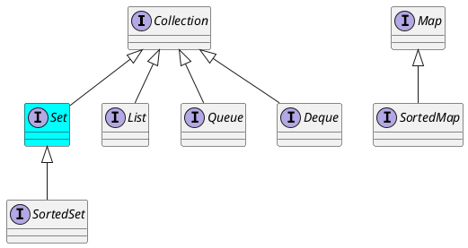

<!-- slide -->

# Set Interface

<!-- slide -->

## Inheritance Hierarchy

<!-- slide -->

## Operations

* `boolean contains(Object o)`
* `boolean add(E e)`
* `boolean remove(Object o)`
* `boolean retainAll(Collection<?> c)`

<!-- slide -->

## Implementations

* General-Purpose
    * HashSet
    * TreeSet
    * LinkedHashSet
* Special-Purpose
    * EnumSet
    * CopyOnWriteArraySet

<!-- slide -->

## Reading

* [The Set Interface](https://docs.oracle.com/javase/tutorial/collections/interfaces/set.html)

<!-- slide -->

## Thank You