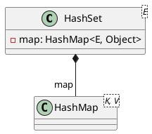

<style>
.reveal h1, .reveal h2, .reveal h3, .reveal h4, .reveal h5, .reveal h6 {
    text-transform: none;
}
.reveal .slide svg {
    background-color: white;
}
.reveal .large-table tr {
    line-height: 1;
}
</style>

<!-- slide -->

# HashSet

<!-- slide -->

## Data Structure



<!-- slide -->

## Operations

HashSet|HashMap
-------|-------
`contains(Object o)`|`containsKey(Object o)`
`add(E e)`|`put(K e, V dummy)`
`remove(Object o)`|`remove(K o)`
`retainAll(Collection<?> c)`|`containsKey(Object o)`<br/>`remove(Object o)`

<!-- slide -->

## `boolean contains(Object o)`

```java
public boolean contains(Object o) {
    return map.containsKey(o);
}
```

<!-- slide -->

## contains - Time Complexity

$$
\begin{align*}
complexity &= \mathcal{O}(1)
\end{align*}
$$

<!-- slide class="large-table" -->

## contains - Benchmark

Operation|(n)|Score|Unit
---------|---|-----|-----
contains|10000|0.022|s/op
contains|20000|0.024|s/op
contains|30000|0.023|s/op
contains|40000|0.028|s/op
contains|50000|0.027|s/op
contains|60000|0.032|s/op
contains|70000|0.038|s/op
contains|80000|0.045|s/op
contains|90000|0.051|s/op
contains|100000|0.041|s/op

<!-- slide -->

## contains - Benchmark

```python {cmd=true hide=true args=["-W ignore"] matplotlib=true}
import numpy as np
from scipy.optimize import curve_fit
import matplotlib.pyplot as plt
x = np.array([10000,20000,30000,40000,50000,60000,70000,80000,90000,100000],dtype=float)
y = np.array([0.022,0.024,0.023,0.028,0.027,0.032,0.038,0.045,0.051,0.041],dtype=float)

plt.plot(x,y,'ro')
plt.ylim([0,0.5])
plt.xlabel('(n)')
plt.ylabel('AverageTime')

def bigOn(x, a, b):
    return a * x + b

def bigO1(x,a):
    return 0 * x + a

def fitAndDrawCurve(func, variables, outcomes, notation,figure):
    popt, pcov = curve_fit(func, variables, outcomes)
    handler, = figure.plot(variables, func(variables, *popt), notation, label="Fitted Curve")
    return handler

bigO1Handler = fitAndDrawCurve(bigO1,x,y,'r-',plt)

plt.legend([bigO1Handler],['y = 0 * x + a'])
plt.show() # show figre
```

<!-- slide -->

## add

```java
public boolean add(E e) {
    return map.put(e, PRESENT)==null;
}
```

<!-- slide -->

## add - Time Complexity

$$
\begin{align*}
complexity &= complexity_{hash} + \mathcal{O}(1) \\
&= \mathcal{O}(1) + \mathcal{O}(1) \\
&= \mathcal{O}(1)
\end{align*}
$$

<!-- slide class="large-table" -->

## add - Benchmark

Operations|(n)|Score|Unit
----------|---|-----|----
add|10000|0.213|s/op
add|20000|0.157|s/op
add|30000|0.221|s/op
add|40000|0.182|s/op
add|50000|0.172|s/op
add|60000|0.221|s/op
add|70000|0.226|s/op
add|80000|0.201|s/op
add|90000|0.230|s/op
add|100000|0.215|s/op

<!-- slide -->

## add - Benchmark

```python {cmd=true hide=true args=["-W ignore"] matplotlib=true}
import numpy as np
from scipy.optimize import curve_fit
import matplotlib.pyplot as plt
x = np.array([10000,20000,30000,40000,50000,60000,70000,80000,90000,100000],dtype=float)
y = np.array([0.213,0.157,0.221,0.182,0.172,0.221,0.226,0.201,0.230,0.215],dtype=float)

plt.plot(x,y,'ro')
plt.ylim([0,0.5])
plt.xlabel('(n)')
plt.ylabel('AverageTime')

def bigOn(x, a, b):
    return a * x + b

def bigO1(x,a):
    return 0 * x + a

def fitAndDrawCurve(func, variables, outcomes, notation,figure):
    popt, pcov = curve_fit(func, variables, outcomes)
    handler, = figure.plot(variables, func(variables, *popt), notation, label="Fitted Curve")
    return handler

bigO1Handler = fitAndDrawCurve(bigO1,x,y,'r-',plt)

plt.legend([bigO1Handler],['y = 0 * x + a'])
plt.show() # show figre
```

<!-- slide -->

## remove

```java
public boolean remove(Object o) {
    return map.remove(o)==PRESENT;
}
```

<!-- slide -->

## remove - Time Complexity

$$
\begin{align*}
complexity &= complexity_{hash} + \mathcal{O}(1) \\
&= \mathcal{O}(1) + \mathcal{O}(1) \\
&= \mathcal{O}(1)
\end{align*}
$$

<!-- slide class="large-table" -->

## remove - Benchmark

Operation|(n)|Score|Unit
---------|---|-----|-----
remove|10000|0.024|s/op
remove|20000|0.025|s/op
remove|30000|0.024|s/op
remove|40000|0.029|s/op
remove|50000|0.026|s/op
remove|60000|0.032|s/op
remove|70000|0.035|s/op
remove|80000|0.044|s/op
remove|90000|0.047|s/op
remove|100000|0.037|s/op

<!-- slide -->

## remove - Benchmark

```python {cmd=true hide=true args=["-W ignore"] matplotlib=true}
import numpy as np
from scipy.optimize import curve_fit
import matplotlib.pyplot as plt
x = np.array([10000,20000,30000,40000,50000,60000,70000,80000,90000,100000],dtype=float)
y = np.array([0.024,0.025,0.024,0.029,0.026,0.032,0.035,0.044,0.047,0.037],dtype=float)

plt.plot(x,y,'ro')
plt.ylim([0,0.5])
plt.xlabel('(n)')
plt.ylabel('AverageTime')

def bigOn(x, a, b):
    return a * x + b

def bigO1(x,a):
    return 0 * x + a

def fitAndDrawCurve(func, variables, outcomes, notation,figure):
    popt, pcov = curve_fit(func, variables, outcomes)
    handler, = figure.plot(variables, func(variables, *popt), notation, label="Fitted Curve")
    return handler

bigO1Handler = fitAndDrawCurve(bigO1,x,y,'r-',plt)

plt.legend([bigO1Handler],['y = 0 * x + a'])
plt.show() # show figre
```

<!-- slide -->

## retainAll

```java
public boolean retainAll(Collection<?> c) {
    Objects.requireNonNull(c);
    boolean modified = false;
    Iterator<E> it = iterator();
    while (it.hasNext()) {
        if (!c.contains(it.next())) {
            it.remove();
            modified = true;
        }
    }
    return modified;
}
```

<!-- slide -->

## retainAll - Time Complexity

$$
\begin{align*}
complexity &= n * (complexity_{contains} + complexity_{remove}) \\
&= n * (\mathcal{O}(1) + \mathcal{O}(1)) \\
&= \mathcal{O}(n)
\end{align*}
$$

<!-- slide class="large-table" -->

## retainAll - Benchmark

Operations|(n)|Score|Unit
----------|---|-----|-----
retainAll|10000|0.006|s/op
retainAll|20000|0.007|s/op
retainAll|30000|0.007|s/op
retainAll|40000|0.007|s/op
retainAll|50000|0.008|s/op
retainAll|60000|0.008|s/op
retainAll|70000|0.010|s/op
retainAll|80000|0.011|s/op
retainAll|90000|0.012|s/op
retainAll|100000|0.013|s/op

<!-- slide -->

## retainAll - Benchmark

```python {cmd=true hide=true args=["-W ignore"] matplotlib=true}
import numpy as np
from scipy.optimize import curve_fit
import matplotlib.pyplot as plt
x = np.array([10000,20000,30000,40000,50000,60000,70000,80000,90000,100000],dtype=float)
y = np.array([0.006,0.007,0.007,0.007,0.008,0.008,0.010,0.011,0.012,0.013],dtype=float)

plt.plot(x,y,'ro')
plt.ylim(np.amin(y)/10)
plt.xlabel('(n)')
plt.ylabel('AverageTime')

def bigOn(x, a, b):
    return a * x + b

def bigO1(x,a):
    return 0 * x + a

def fitAndDrawCurve(func, variables, outcomes, notation,figure):
    popt, pcov = curve_fit(func, variables, outcomes)
    handler, = figure.plot(variables, func(variables, *popt), notation, label="Fitted Curve")
    return handler

bigO1Handler = fitAndDrawCurve(bigOn,x,y,'r-',plt)

plt.legend([bigO1Handler],['y = a * x + b'])
plt.show() # show figre
```
