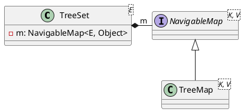

<style>
.reveal h1, .reveal h2, .reveal h3, .reveal h4, .reveal h5, .reveal h6 {
    text-transform: none;
}
.reveal .slide svg {
    background-color: white;
}
.reveal .large-table tr {
    line-height: 1;
}
</style>

<!-- slide -->

# TreeSet

<!-- slide -->

## Data Structure



<!-- slide -->

## Operations

TreeSet|TreeMap
-------|-------
`contains(Object o)`|`containsKey(Object o)`
`add(E e)`|`put(K e, V dummy)`
`remove(Object o)`|`remove(object o)`
`retainAll(Collection<?> c)`|`containsKey(Object o)`<br/>`remove(Object o)`

<!-- slide -->

## contains

```java
public boolean contains(Object o) {
    return m.containsKey(o);
}
```

<!-- slide -->

## contains - Time Complexity

$$
\begin{align*}
complexity &= \mathcal{O}(log_2 n)
\end{align*}
$$

<!-- slide class="large-table" -->

## contains - Benchmark

Operation|(n)|Score|Unit
---------|---|-----|-----
contains|10000|0.150|s/op
contains|20000|0.179|s/op
contains|30000|0.191|s/op
contains|40000|0.206|s/op
contains|50000|0.216|s/op
contains|60000|0.245|s/op
contains|70000|0.303|s/op
contains|80000|0.266|s/op
contains|90000|0.346|s/op
contains|100000|0.409|s/op

<!-- slide -->

## contains - Benchmark

```python {cmd=true hide=true args=["-W ignore"] matplotlib=true}
import numpy as np
from scipy.optimize import curve_fit
import matplotlib.pyplot as plt
x = np.array([10000,20000,30000,40000,50000,60000,70000,80000,90000,100000],dtype=float)
y = np.array([0.150,0.179,0.191,0.206,0.216,0.245,0.303,0.266,0.346,0.409],dtype=float)

plt.plot(x,y,'ro')
plt.ylim(np.amin(y)/10)
plt.xlabel('(n)')
plt.ylabel('AverageTime')

def bigOn(x, a, b):
    return a * x + b

def bigO1(x,a):
    return 0 * x + a

def bigOlogn(x, a, b, c):
    return a * np.log2(b * x) + c

def fitAndDrawCurve(func, variables, outcomes, notation,figure):
    popt, pcov = curve_fit(func, variables, outcomes)
    handler, = figure.plot(variables, func(variables, *popt), notation, label="Fitted Curve")
    return handler

bigOlognHandler = fitAndDrawCurve(bigOlogn,x,y,'r-',plt)
plt.legend([bigOlognHandler],['y = a * log2(b * x) + c'])
plt.show() # show figure
```

<!-- slide -->

## add

```java
public boolean add(E e) {
    return m.put(e, PRESENT)==null;
}
```

<!-- slide -->

## add - Time Complexity

$$
\begin{align*}
complexity &= \mathcal{O}(log_2 n)
\end{align*}
$$

<!-- slide class="large-table" -->

## add - Benchmark

Operation|(n)|Score|Unit
---------|---|-----|----
add|10000|0.957|s/op
add|20000|0.961|s/op
add|30000|0.947|s/op
add|40000|0.999|s/op
add|50000|1.018|s/op
add|60000|0.803|s/op
add|70000|1.009|s/op
add|80000|1.000|s/op
add|90000|1.034|s/op
add|100000|1.022|s/op

<!-- slide -->

## add - Benchmark

```python {cmd=true hide=true args=["-W ignore"] matplotlib=true}
import numpy as np
from scipy.optimize import curve_fit
import matplotlib.pyplot as plt
x = np.array([10000,20000,30000,40000,50000,60000,70000,80000,90000,100000],dtype=float)
y = np.array([0.957,0.961,0.947,0.999,1.018,0.803,1.009,1.000,1.034,1.022],dtype=float)

plt.plot(x,y,'ro')
plt.ylim([0.9, 1.1])
plt.xlabel('(n)')
plt.ylabel('AverageTime')

def bigOn(x, a, b):
    return a * x + b

def bigO1(x,a):
    return 0 * x + a

def bigOlogn(x, a, b, c):
    return a * np.log2(b * x) + c

def fitAndDrawCurve(func, variables, outcomes, notation,figure):
    popt, pcov = curve_fit(func, variables, outcomes)
    handler, = figure.plot(variables, func(variables, *popt), notation, label="Fitted Curve")
    return handler

bigOlognHandler = fitAndDrawCurve(bigOlogn,x,y,'r-',plt)
plt.legend([bigOlognHandler],['y = a * log2(b * x) + c'])
plt.show() # show figure
```

<!-- slide -->

## remove

```java
public boolean remove(Object o) {
    return m.remove(o)==PRESENT;
}
```

<!-- slide -->

## remove - Time Complexity

$$
\begin{align*}
complexity &= \mathcal{O}(log_2 n)
\end{align*}
$$

<!-- slide class="large-table" -->

## remove - Benchmark

Operation|(n)|Score|Unit
---------|---|-----|-----
remove|10000|0.151|s/op
remove|20000|0.181|s/op
remove|30000|0.193|s/op
remove|40000|0.207|s/op
remove|50000|0.219|s/op
remove|60000|0.252|s/op
remove|70000|0.310|s/op
remove|80000|0.348|s/op
remove|90000|0.374|s/op
remove|100000|0.407|s/op

<!-- slide -->

## remove - Benchmark

```python {cmd=true hide=true args=["-W ignore"] matplotlib=true}
import numpy as np
from scipy.optimize import curve_fit
import matplotlib.pyplot as plt
x = np.array([10000,20000,30000,40000,50000,60000,70000,80000,90000,100000],dtype=float)
y = np.array([0.151,0.181,0.193,0.207,0.219,0.252,0.310,0.348,0.374,0.407],dtype=float)

plt.plot(x,y,'ro')
plt.ylim(np.amin(y)/10)
plt.xlabel('(n)')
plt.ylabel('AverageTime')

def bigOn(x, a, b):
    return a * x + b

def bigO1(x,a):
    return 0 * x + a

def bigOlogn(x, a, b, c):
    return a * np.log2(b * x) + c

def fitAndDrawCurve(func, variables, outcomes, notation,figure):
    popt, pcov = curve_fit(func, variables, outcomes)
    handler, = figure.plot(variables, func(variables, *popt), notation, label="Fitted Curve")
    return handler

bigOlognHandler = fitAndDrawCurve(bigOlogn,x,y,'r-',plt)
plt.legend([bigOlognHandler],['y = a * log2(b * x) + c'])
plt.show() # show figure
```

<!-- slide -->

## retainAll

```java
public boolean retainAll(Collection<?> c) {
    Objects.requireNonNull(c);
    boolean modified = false;
    Iterator<E> it = iterator();
    while (it.hasNext()) {
        if (!c.contains(it.next())) {
            it.remove();
            modified = true;
        }
    }
    return modified;
}
```

<!-- slide -->

## retainAll - Time Complexity

$$
\begin{align*}
complexity &= n * (\mathcal{O}(log_2 n) + \mathcal{O}(log_2 n)) \\
&= \mathcal{O}(nlog_2 n)
\end{align*}
$$

<!-- slide class="large-table" -->

## retainAll - Benchmark

Operation|(n)|Score|Unit
---------|---|-----|----
retainAll|10000|0.006|s/op
retainAll|20000|0.007|s/op
retainAll|30000|0.007|s/op
retainAll|40000|0.007|s/op
retainAll|50000|0.008|s/op
retainAll|60000|0.009|s/op
retainAll|70000|0.009|s/op
retainAll|80000|0.012|s/op
retainAll|90000|0.013|s/op
retainAll|100000|0.014|s/op

<!-- slide -->

## retainAll - Benchmark

```python {cmd=true hide=true args=["-W ignore"] matplotlib=true}
import numpy as np
from scipy.optimize import curve_fit
import matplotlib.pyplot as plt
x = np.array([10000,20000,30000,40000,50000,60000,70000,80000,90000,100000],dtype=float)
y = np.array([0.006,0.007,0.007,0.007,0.008,0.009,0.009,0.012,0.013,0.014],dtype=float)

plt.plot(x,y,'ro')
plt.ylim(np.amin(y)/10)
plt.xlabel('(n)')
plt.ylabel('AverageTime')

def bigOn(x, a, b):
    return a * x + b

def bigO1(x,a):
    return 0 * x + a

def bigOlogn(x, a, b, c):
    return a * np.log2(b * x) + c

def bigOnlogn(x, a, b, c):
    return a * x * np.log2(b * x) + c

def fitAndDrawCurve(func, variables, outcomes, notation,figure):
    popt, pcov = curve_fit(func, variables, outcomes)
    handler, = figure.plot(variables, func(variables, *popt), notation, label="Fitted Curve")
    return handler

bigOlognHandler = fitAndDrawCurve(bigOnlogn,x,y,'r-',plt)
plt.legend([bigOlognHandler],['y = a * x * log2(b * x) + c'])
plt.show() # show figure
```
